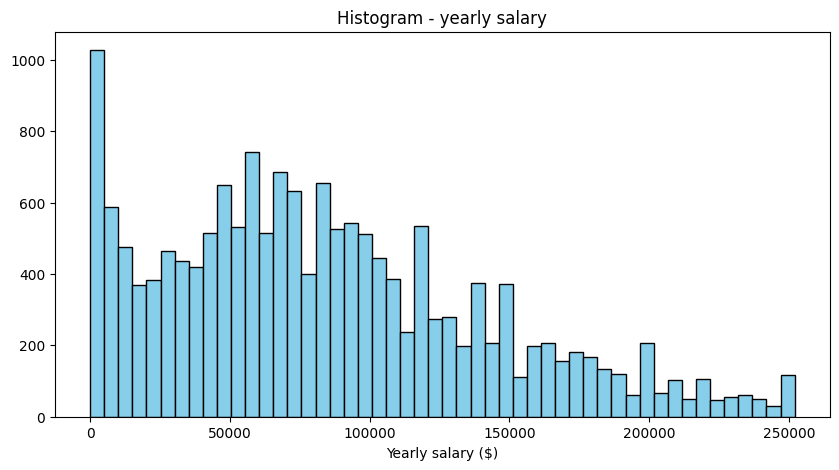
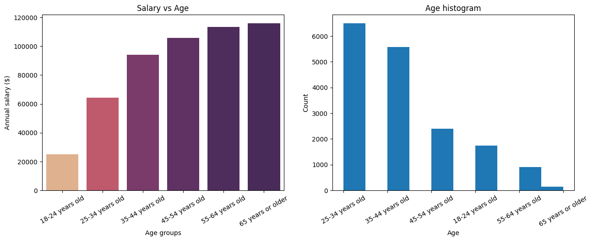
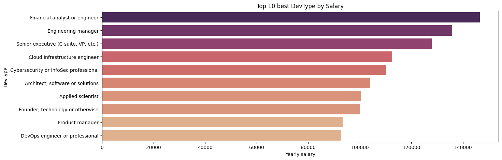
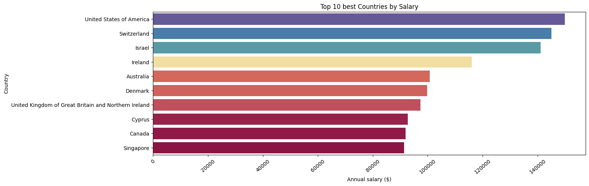
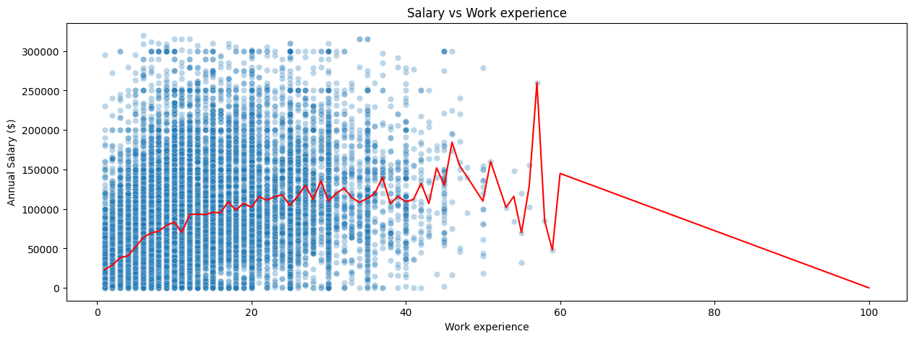
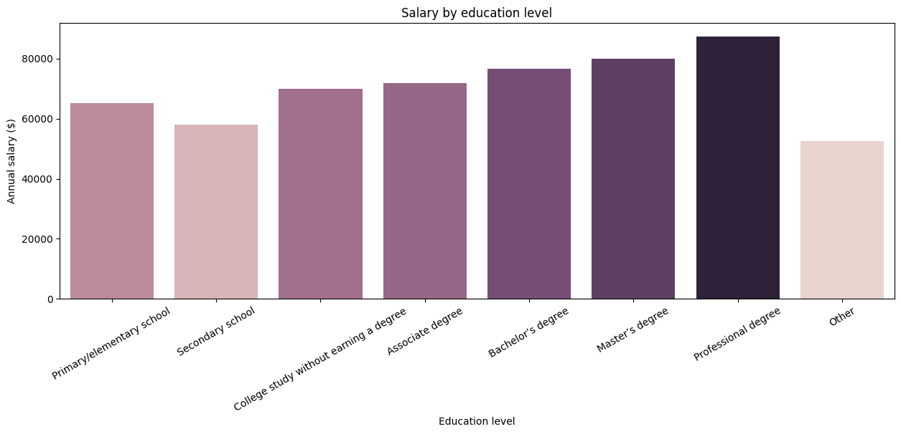
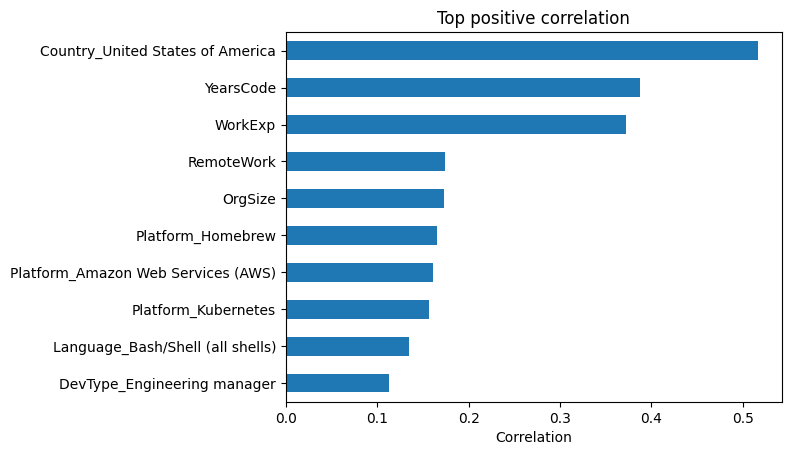
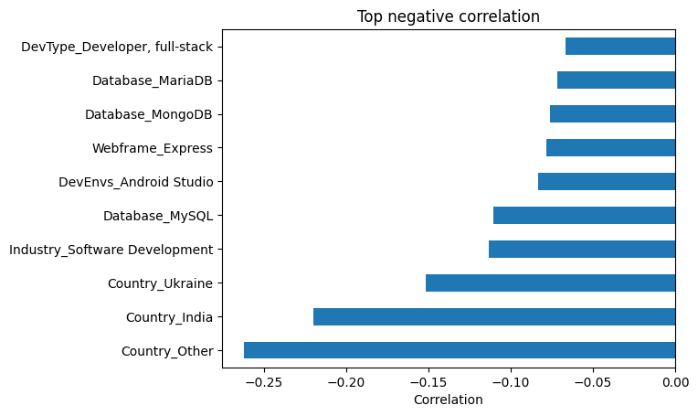
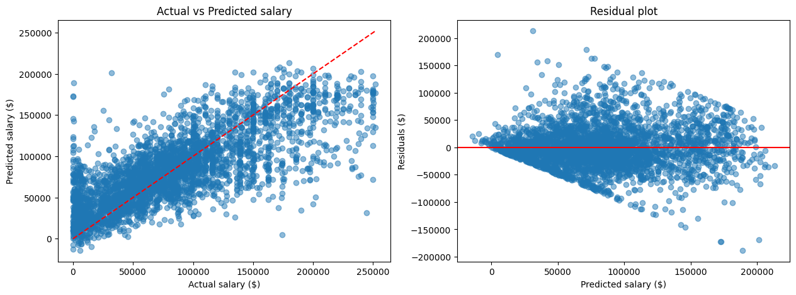
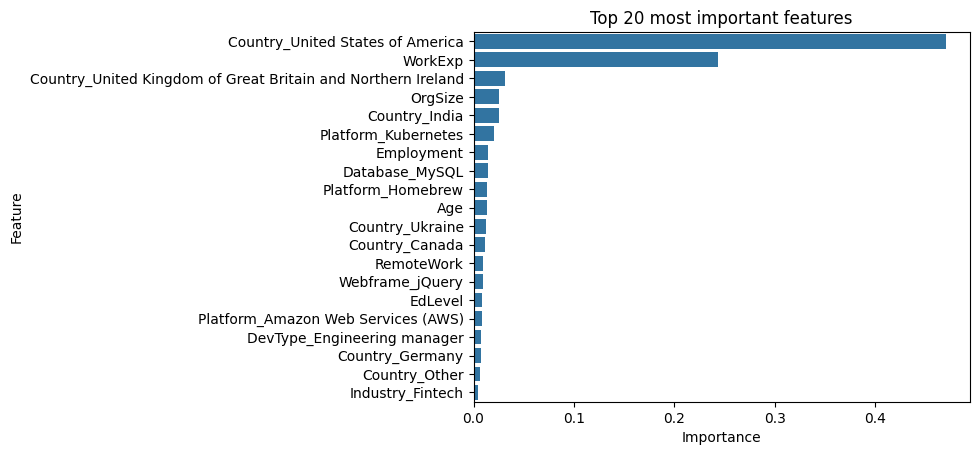

```python
import numpy as np
import pandas as pd
import seaborn as sns
import matplotlib.pyplot as plt
from sklearn.model_selection import train_test_split
from sklearn.linear_model import LinearRegression
from sklearn.metrics import r2_score,mean_absolute_error, mean_squared_error
```

- [Introduction](#introduction)
- [Data Cleaning](#data-cleaning)
- [Feature Engineering](#feature-engineering)
- [EDA](#eda)
- [Modeling](#modeling)
- [Evaluation](#evaluation)
- [Conclusions](#conclusions)

# Introduction


*   The goal of this project is to predict developer salaries based on survey data from the Stack Overflow Developer Survey
*   An important part of the project is data preprocessing and feature engineering, due to poor quality data and missing values
* The project also aims to investigate which features have the greatest impact on the salary
* Several machine learning models were evaluated, including Linear Regression, Random Forest and Gradient Boosting Regressor


# Data Cleaning


```python
data1 = pd.read_csv('survey_results_public.csv')#,on_bad_lines='skip')
```

    /tmp/ipykernel_926/274616350.py:1: DtypeWarning: Columns (56,74,92,97,98,105,109,110,132,162,165) have mixed types. Specify dtype option on import or set low_memory=False.
      data1 = pd.read_csv('survey_results_public.csv')#,on_bad_lines='skip')
    

#### choosing columns for modeling


```python
print(list(data1.columns))
```

    ['ResponseId', 'MainBranch', 'Age', 'EdLevel', 'Employment', 'EmploymentAddl', 'WorkExp', 'LearnCodeChoose', 'LearnCode', 'LearnCodeAI', 'AILearnHow', 'YearsCode', 'DevType', 'OrgSize', 'ICorPM', 'RemoteWork', 'PurchaseInfluence', 'TechEndorseIntro', 'TechEndorse_1', 'TechEndorse_2', 'TechEndorse_3', 'TechEndorse_4', 'TechEndorse_5', 'TechEndorse_6', 'TechEndorse_7', 'TechEndorse_8', 'TechEndorse_9', 'TechEndorse_13', 'TechEndorse_13_TEXT', 'TechOppose_1', 'TechOppose_2', 'TechOppose_3', 'TechOppose_5', 'TechOppose_7', 'TechOppose_9', 'TechOppose_11', 'TechOppose_13', 'TechOppose_16', 'TechOppose_15', 'TechOppose_15_TEXT', 'Industry', 'JobSatPoints_1', 'JobSatPoints_2', 'JobSatPoints_3', 'JobSatPoints_4', 'JobSatPoints_5', 'JobSatPoints_6', 'JobSatPoints_7', 'JobSatPoints_8', 'JobSatPoints_9', 'JobSatPoints_10', 'JobSatPoints_11', 'JobSatPoints_13', 'JobSatPoints_14', 'JobSatPoints_15', 'JobSatPoints_16', 'JobSatPoints_15_TEXT', 'AIThreat', 'NewRole', 'ToolCountWork', 'ToolCountPersonal', 'Country', 'Currency', 'CompTotal', 'LanguageChoice', 'LanguageHaveWorkedWith', 'LanguageWantToWorkWith', 'LanguageAdmired', 'LanguagesHaveEntry', 'LanguagesWantEntry', 'DatabaseChoice', 'DatabaseHaveWorkedWith', 'DatabaseWantToWorkWith', 'DatabaseAdmired', 'DatabaseHaveEntry', 'DatabaseWantEntry', 'PlatformChoice', 'PlatformHaveWorkedWith', 'PlatformWantToWorkWith', 'PlatformAdmired', 'PlatformHaveEntry', 'PlatformWantEntry', 'WebframeChoice', 'WebframeHaveWorkedWith', 'WebframeWantToWorkWith', 'WebframeAdmired', 'WebframeHaveEntry', 'WebframeWantEntry', 'DevEnvsChoice', 'DevEnvsHaveWorkedWith', 'DevEnvsWantToWorkWith', 'DevEnvsAdmired', 'DevEnvHaveEntry', 'DevEnvWantEntry', 'SOTagsHaveWorkedWith', 'SOTagsWantToWorkWith', 'SOTagsAdmired', 'SOTagsHaveEntry', 'SOTagsWant Entry', 'OpSysPersonal use', 'OpSysProfessional use', 'OfficeStackAsyncHaveWorkedWith', 'OfficeStackAsyncWantToWorkWith', 'OfficeStackAsyncAdmired', 'OfficeStackHaveEntry', 'OfficeStackWantEntry', 'CommPlatformHaveWorkedWith', 'CommPlatformWantToWorkWith', 'CommPlatformAdmired', 'CommPlatformHaveEntr', 'CommPlatformWantEntr', 'AIModelsChoice', 'AIModelsHaveWorkedWith', 'AIModelsWantToWorkWith', 'AIModelsAdmired', 'AIModelsHaveEntry', 'AIModelsWantEntry', 'SOAccount', 'SOVisitFreq', 'SODuration', 'SOPartFreq', 'SO_Dev_Content', 'SO_Actions_1', 'SO_Actions_16', 'SO_Actions_3', 'SO_Actions_4', 'SO_Actions_5', 'SO_Actions_6', 'SO_Actions_9', 'SO_Actions_7', 'SO_Actions_10', 'SO_Actions_15', 'SO_Actions_15_TEXT', 'SOComm', 'SOFriction', 'AISelect', 'AISent', 'AIAcc', 'AIComplex', 'AIToolCurrently partially AI', "AIToolDon't plan to use AI for this task", 'AIToolPlan to partially use AI', 'AIToolPlan to mostly use AI', 'AIToolCurrently mostly AI', 'AIFrustration', 'AIExplain', 'AIAgents', 'AIAgentChange', 'AIAgent_Uses', 'AgentUsesGeneral', 'AIAgentImpactSomewhat agree', 'AIAgentImpactNeutral', 'AIAgentImpactSomewhat disagree', 'AIAgentImpactStrongly agree', 'AIAgentImpactStrongly disagree', 'AIAgentChallengesNeutral', 'AIAgentChallengesSomewhat disagree', 'AIAgentChallengesStrongly agree', 'AIAgentChallengesSomewhat agree', 'AIAgentChallengesStrongly disagree', 'AIAgentKnowledge', 'AIAgentKnowWrite', 'AIAgentOrchestration', 'AIAgentOrchWrite', 'AIAgentObserveSecure', 'AIAgentObsWrite', 'AIAgentExternal', 'AIAgentExtWrite', 'AIHuman', 'AIOpen', 'ConvertedCompYearly', 'JobSat']
    


```python
org_data = pd.DataFrame(data1, columns=['MainBranch','Age','EdLevel','Employment','WorkExp','YearsCode','DevType','OrgSize','RemoteWork','Industry','Country','LanguageHaveWorkedWith',
                                   'DatabaseHaveWorkedWith','PlatformHaveWorkedWith','WebframeHaveWorkedWith','DevEnvsHaveWorkedWith',
                                    'AIModelsHaveWorkedWith','ConvertedCompYearly'])
```

#### removing duplicates


```python
org_data = org_data.drop_duplicates()
```


```python
org_data = org_data[org_data['ConvertedCompYearly'].notna()]
```

#### dropping columns with more than 50% missing values


```python
org_data.isnull().sum()*100/(len(org_data))
```


<div>
<style scoped>
    .dataframe tbody tr th:only-of-type {
        vertical-align: middle;
    }

    .dataframe tbody tr th {
        vertical-align: top;
    }

    .dataframe thead th {
        text-align: right;
    }
</style>
<table border="1" class="dataframe">
  <thead>
    <tr style="text-align: right;">
      <th></th>
      <th>0</th>
    </tr>
  </thead>
  <tbody>
    <tr>
      <th>MainBranch</th>
      <td>0.000000</td>
    </tr>
    <tr>
      <th>Age</th>
      <td>0.000000</td>
    </tr>
    <tr>
      <th>EdLevel</th>
      <td>0.070996</td>
    </tr>
    <tr>
      <th>Employment</th>
      <td>0.000000</td>
    </tr>
    <tr>
      <th>WorkExp</th>
      <td>1.996241</td>
    </tr>
    <tr>
      <th>YearsCode</th>
      <td>0.455210</td>
    </tr>
    <tr>
      <th>DevType</th>
      <td>0.000000</td>
    </tr>
    <tr>
      <th>OrgSize</th>
      <td>11.451242</td>
    </tr>
    <tr>
      <th>RemoteWork</th>
      <td>11.902276</td>
    </tr>
    <tr>
      <th>Industry</th>
      <td>3.817081</td>
    </tr>
    <tr>
      <th>Country</th>
      <td>0.000000</td>
    </tr>
    <tr>
      <th>LanguageHaveWorkedWith</th>
      <td>7.625809</td>
    </tr>
    <tr>
      <th>DatabaseHaveWorkedWith</th>
      <td>22.848194</td>
    </tr>
    <tr>
      <th>PlatformHaveWorkedWith</th>
      <td>25.387346</td>
    </tr>
    <tr>
      <th>WebframeHaveWorkedWith</th>
      <td>30.661934</td>
    </tr>
    <tr>
      <th>DevEnvsHaveWorkedWith</th>
      <td>21.482564</td>
    </tr>
    <tr>
      <th>AIModelsHaveWorkedWith</th>
      <td>49.914387</td>
    </tr>
    <tr>
      <th>ConvertedCompYearly</th>
      <td>0.000000</td>
    </tr>
  </tbody>
</table>
</div><br><label><b>dtype:</b> float64</label>


```python
org_data = org_data.drop(columns='AIModelsHaveWorkedWith',axis=1)
```


```python
org_data.info()
```

    <class 'pandas.core.frame.DataFrame'>
    Index: 23945 entries, 0 to 49122
    Data columns (total 17 columns):
     #   Column                  Non-Null Count  Dtype  
    ---  ------                  --------------  -----  
     0   MainBranch              23945 non-null  object 
     1   Age                     23945 non-null  object 
     2   EdLevel                 23928 non-null  object 
     3   Employment              23945 non-null  object 
     4   WorkExp                 23467 non-null  float64
     5   YearsCode               23836 non-null  float64
     6   DevType                 23945 non-null  object 
     7   OrgSize                 21203 non-null  object 
     8   RemoteWork              21095 non-null  object 
     9   Industry                23031 non-null  object 
     10  Country                 23945 non-null  object 
     11  LanguageHaveWorkedWith  22119 non-null  object 
     12  DatabaseHaveWorkedWith  18474 non-null  object 
     13  PlatformHaveWorkedWith  17866 non-null  object 
     14  WebframeHaveWorkedWith  16603 non-null  object 
     15  DevEnvsHaveWorkedWith   18801 non-null  object 
     16  ConvertedCompYearly     23945 non-null  float64
    dtypes: float64(3), object(14)
    memory usage: 3.3+ MB
    


```python
org_data.head()
```


  <div id="df-42d914de-c011-40fb-9283-9f9c84853b3a" class="colab-df-container">
    <div>
<style scoped>
    .dataframe tbody tr th:only-of-type {
        vertical-align: middle;
    }

    .dataframe tbody tr th {
        vertical-align: top;
    }

    .dataframe thead th {
        text-align: right;
    }
</style>
<table border="1" class="dataframe">
  <thead>
    <tr style="text-align: right;">
      <th></th>
      <th>MainBranch</th>
      <th>Age</th>
      <th>EdLevel</th>
      <th>Employment</th>
      <th>WorkExp</th>
      <th>YearsCode</th>
      <th>DevType</th>
      <th>OrgSize</th>
      <th>RemoteWork</th>
      <th>Industry</th>
      <th>Country</th>
      <th>LanguageHaveWorkedWith</th>
      <th>DatabaseHaveWorkedWith</th>
      <th>PlatformHaveWorkedWith</th>
      <th>WebframeHaveWorkedWith</th>
      <th>DevEnvsHaveWorkedWith</th>
      <th>ConvertedCompYearly</th>
    </tr>
  </thead>
  <tbody>
    <tr>
      <th>0</th>
      <td>I am a developer by profession</td>
      <td>25-34 years old</td>
      <td>Master’s degree (M.A., M.S., M.Eng., MBA, etc.)</td>
      <td>Employed</td>
      <td>8.0</td>
      <td>14.0</td>
      <td>Developer, mobile</td>
      <td>20 to 99 employees</td>
      <td>Remote</td>
      <td>Fintech</td>
      <td>Ukraine</td>
      <td>Bash/Shell (all shells);Dart;SQL</td>
      <td>Cloud Firestore;PostgreSQL</td>
      <td>Amazon Web Services (AWS);Cloudflare;Firebase;...</td>
      <td>NaN</td>
      <td>Android Studio;Notepad++;Visual Studio;Visual ...</td>
      <td>61256.0</td>
    </tr>
    <tr>
      <th>1</th>
      <td>I am a developer by profession</td>
      <td>25-34 years old</td>
      <td>Associate degree (A.A., A.S., etc.)</td>
      <td>Employed</td>
      <td>2.0</td>
      <td>10.0</td>
      <td>Developer, back-end</td>
      <td>500 to 999 employees</td>
      <td>Hybrid (some in-person, leans heavy to flexibi...</td>
      <td>Retail and Consumer Services</td>
      <td>Netherlands</td>
      <td>Java</td>
      <td>Dynamodb;MongoDB</td>
      <td>Amazon Web Services (AWS);Datadog;Docker;Homeb...</td>
      <td>Spring Boot</td>
      <td>IntelliJ IDEA;PyCharm;Visual Studio Code;Xcode</td>
      <td>104413.0</td>
    </tr>
    <tr>
      <th>2</th>
      <td>I am a developer by profession</td>
      <td>35-44 years old</td>
      <td>Bachelor’s degree (B.A., B.S., B.Eng., etc.)</td>
      <td>Independent contractor, freelancer, or self-em...</td>
      <td>10.0</td>
      <td>12.0</td>
      <td>Developer, front-end</td>
      <td>NaN</td>
      <td>NaN</td>
      <td>Software Development</td>
      <td>Ukraine</td>
      <td>Dart;HTML/CSS;JavaScript;TypeScript</td>
      <td>MongoDB;MySQL;PostgreSQL</td>
      <td>Datadog;Firebase;npm;pnpm</td>
      <td>Next.js;Node.js;React</td>
      <td>Visual Studio Code</td>
      <td>53061.0</td>
    </tr>
    <tr>
      <th>3</th>
      <td>I am a developer by profession</td>
      <td>35-44 years old</td>
      <td>Bachelor’s degree (B.A., B.S., B.Eng., etc.)</td>
      <td>Employed</td>
      <td>4.0</td>
      <td>5.0</td>
      <td>Developer, back-end</td>
      <td>10,000 or more employees</td>
      <td>Remote</td>
      <td>Retail and Consumer Services</td>
      <td>Ukraine</td>
      <td>Java;Kotlin;SQL</td>
      <td>NaN</td>
      <td>Amazon Web Services (AWS);Google Cloud</td>
      <td>Spring Boot</td>
      <td>NaN</td>
      <td>36197.0</td>
    </tr>
    <tr>
      <th>4</th>
      <td>I am a developer by profession</td>
      <td>35-44 years old</td>
      <td>Master’s degree (M.A., M.S., M.Eng., MBA, etc.)</td>
      <td>Independent contractor, freelancer, or self-em...</td>
      <td>21.0</td>
      <td>22.0</td>
      <td>Engineering manager</td>
      <td>NaN</td>
      <td>NaN</td>
      <td>Software Development</td>
      <td>Ukraine</td>
      <td>C;C#;C++;Delphi;HTML/CSS;Java;JavaScript;Lua;P...</td>
      <td>Elasticsearch;Microsoft SQL Server;MySQL;Oracl...</td>
      <td>Amazon Web Services (AWS);APT;Docker;Make;Mave...</td>
      <td>Angular;ASP.NET;ASP.NET Core;Flask;jQuery</td>
      <td>Eclipse;IntelliJ IDEA;Jupyter Notebook/Jupyter...</td>
      <td>60000.0</td>
    </tr>
  </tbody>
</table>
</div>
    <div class="colab-df-buttons">

  <div class="colab-df-container">
    <button class="colab-df-convert" onclick="convertToInteractive('df-42d914de-c011-40fb-9283-9f9c84853b3a')"
            title="Convert this dataframe to an interactive table."
            style="display:none;">

  <svg xmlns="http://www.w3.org/2000/svg" height="24px" viewBox="0 -960 960 960">
    <path d="M120-120v-720h720v720H120Zm60-500h600v-160H180v160Zm220 220h160v-160H400v160Zm0 220h160v-160H400v160ZM180-400h160v-160H180v160Zm440 0h160v-160H620v160ZM180-180h160v-160H180v160Zm440 0h160v-160H620v160Z"/>
  </svg>
    </button>

  <style>
    .colab-df-container {
      display:flex;
      gap: 12px;
    }

    .colab-df-convert {
      background-color: #E8F0FE;
      border: none;
      border-radius: 50%;
      cursor: pointer;
      display: none;
      fill: #1967D2;
      height: 32px;
      padding: 0 0 0 0;
      width: 32px;
    }

    .colab-df-convert:hover {
      background-color: #E2EBFA;
      box-shadow: 0px 1px 2px rgba(60, 64, 67, 0.3), 0px 1px 3px 1px rgba(60, 64, 67, 0.15);
      fill: #174EA6;
    }

    .colab-df-buttons div {
      margin-bottom: 4px;
    }

    [theme=dark] .colab-df-convert {
      background-color: #3B4455;
      fill: #D2E3FC;
    }

    [theme=dark] .colab-df-convert:hover {
      background-color: #434B5C;
      box-shadow: 0px 1px 3px 1px rgba(0, 0, 0, 0.15);
      filter: drop-shadow(0px 1px 2px rgba(0, 0, 0, 0.3));
      fill: #FFFFFF;
    }
  </style>

    <script>
      const buttonEl =
        document.querySelector('#df-42d914de-c011-40fb-9283-9f9c84853b3a button.colab-df-convert');
      buttonEl.style.display =
        google.colab.kernel.accessAllowed ? 'block' : 'none';

      async function convertToInteractive(key) {
        const element = document.querySelector('#df-42d914de-c011-40fb-9283-9f9c84853b3a');
        const dataTable =
          await google.colab.kernel.invokeFunction('convertToInteractive',
                                                    [key], {});
        if (!dataTable) return;

        const docLinkHtml = 'Like what you see? Visit the ' +
          '<a target="_blank" href=https://colab.research.google.com/notebooks/data_table.ipynb>data table notebook</a>'
          + ' to learn more about interactive tables.';
        element.innerHTML = '';
        dataTable['output_type'] = 'display_data';
        await google.colab.output.renderOutput(dataTable, element);
        const docLink = document.createElement('div');
        docLink.innerHTML = docLinkHtml;
        element.appendChild(docLink);
      }
    </script>
  </div>


    </div>
  </div>


```python
# filling null values with median or mode
for col in ['WorkExp','YearsCode']:
    org_data[col] = org_data[col].fillna(org_data[col].median())

for col in ['EdLevel','OrgSize','RemoteWork','Industry']:
    org_data[col]= org_data[col].fillna(org_data[col].mode()[0])

# filling null values and splitting strings in a column into a list
listy = ['DevType','LanguageHaveWorkedWith','DatabaseHaveWorkedWith','PlatformHaveWorkedWith','WebframeHaveWorkedWith','DevEnvsHaveWorkedWith']

for col in listy:
    org_data[col] = org_data[col].fillna('Unknown')
    org_data[col] = org_data[col].str.split(';')
```


```python
org_data.head()
```


  <div id="df-2dfbe04d-164c-4eaa-bada-93ef4d6890d8" class="colab-df-container">
    <div>
<style scoped>
    .dataframe tbody tr th:only-of-type {
        vertical-align: middle;
    }

    .dataframe tbody tr th {
        vertical-align: top;
    }

    .dataframe thead th {
        text-align: right;
    }
</style>
<table border="1" class="dataframe">
  <thead>
    <tr style="text-align: right;">
      <th></th>
      <th>MainBranch</th>
      <th>Age</th>
      <th>EdLevel</th>
      <th>Employment</th>
      <th>WorkExp</th>
      <th>YearsCode</th>
      <th>DevType</th>
      <th>OrgSize</th>
      <th>RemoteWork</th>
      <th>Industry</th>
      <th>Country</th>
      <th>LanguageHaveWorkedWith</th>
      <th>DatabaseHaveWorkedWith</th>
      <th>PlatformHaveWorkedWith</th>
      <th>WebframeHaveWorkedWith</th>
      <th>DevEnvsHaveWorkedWith</th>
      <th>ConvertedCompYearly</th>
    </tr>
  </thead>
  <tbody>
    <tr>
      <th>0</th>
      <td>I am a developer by profession</td>
      <td>25-34 years old</td>
      <td>Master’s degree (M.A., M.S., M.Eng., MBA, etc.)</td>
      <td>Employed</td>
      <td>8.0</td>
      <td>14.0</td>
      <td>[Developer, mobile]</td>
      <td>20 to 99 employees</td>
      <td>Remote</td>
      <td>Fintech</td>
      <td>Ukraine</td>
      <td>[Bash/Shell (all shells), Dart, SQL]</td>
      <td>[Cloud Firestore, PostgreSQL]</td>
      <td>[Amazon Web Services (AWS), Cloudflare, Fireba...</td>
      <td>[Unknown]</td>
      <td>[Android Studio, Notepad++, Visual Studio, Vis...</td>
      <td>61256.0</td>
    </tr>
    <tr>
      <th>1</th>
      <td>I am a developer by profession</td>
      <td>25-34 years old</td>
      <td>Associate degree (A.A., A.S., etc.)</td>
      <td>Employed</td>
      <td>2.0</td>
      <td>10.0</td>
      <td>[Developer, back-end]</td>
      <td>500 to 999 employees</td>
      <td>Hybrid (some in-person, leans heavy to flexibi...</td>
      <td>Retail and Consumer Services</td>
      <td>Netherlands</td>
      <td>[Java]</td>
      <td>[Dynamodb, MongoDB]</td>
      <td>[Amazon Web Services (AWS), Datadog, Docker, H...</td>
      <td>[Spring Boot]</td>
      <td>[IntelliJ IDEA, PyCharm, Visual Studio Code, X...</td>
      <td>104413.0</td>
    </tr>
    <tr>
      <th>2</th>
      <td>I am a developer by profession</td>
      <td>35-44 years old</td>
      <td>Bachelor’s degree (B.A., B.S., B.Eng., etc.)</td>
      <td>Independent contractor, freelancer, or self-em...</td>
      <td>10.0</td>
      <td>12.0</td>
      <td>[Developer, front-end]</td>
      <td>20 to 99 employees</td>
      <td>Remote</td>
      <td>Software Development</td>
      <td>Ukraine</td>
      <td>[Dart, HTML/CSS, JavaScript, TypeScript]</td>
      <td>[MongoDB, MySQL, PostgreSQL]</td>
      <td>[Datadog, Firebase, npm, pnpm]</td>
      <td>[Next.js, Node.js, React]</td>
      <td>[Visual Studio Code]</td>
      <td>53061.0</td>
    </tr>
    <tr>
      <th>3</th>
      <td>I am a developer by profession</td>
      <td>35-44 years old</td>
      <td>Bachelor’s degree (B.A., B.S., B.Eng., etc.)</td>
      <td>Employed</td>
      <td>4.0</td>
      <td>5.0</td>
      <td>[Developer, back-end]</td>
      <td>10,000 or more employees</td>
      <td>Remote</td>
      <td>Retail and Consumer Services</td>
      <td>Ukraine</td>
      <td>[Java, Kotlin, SQL]</td>
      <td>[Unknown]</td>
      <td>[Amazon Web Services (AWS), Google Cloud]</td>
      <td>[Spring Boot]</td>
      <td>[Unknown]</td>
      <td>36197.0</td>
    </tr>
    <tr>
      <th>4</th>
      <td>I am a developer by profession</td>
      <td>35-44 years old</td>
      <td>Master’s degree (M.A., M.S., M.Eng., MBA, etc.)</td>
      <td>Independent contractor, freelancer, or self-em...</td>
      <td>21.0</td>
      <td>22.0</td>
      <td>[Engineering manager]</td>
      <td>20 to 99 employees</td>
      <td>Remote</td>
      <td>Software Development</td>
      <td>Ukraine</td>
      <td>[C, C#, C++, Delphi, HTML/CSS, Java, JavaScrip...</td>
      <td>[Elasticsearch, Microsoft SQL Server, MySQL, O...</td>
      <td>[Amazon Web Services (AWS), APT, Docker, Make,...</td>
      <td>[Angular, ASP.NET, ASP.NET Core, Flask, jQuery]</td>
      <td>[Eclipse, IntelliJ IDEA, Jupyter Notebook/Jupy...</td>
      <td>60000.0</td>
    </tr>
  </tbody>
</table>
</div>
    <div class="colab-df-buttons">

  <div class="colab-df-container">
    <button class="colab-df-convert" onclick="convertToInteractive('df-2dfbe04d-164c-4eaa-bada-93ef4d6890d8')"
            title="Convert this dataframe to an interactive table."
            style="display:none;">

  <svg xmlns="http://www.w3.org/2000/svg" height="24px" viewBox="0 -960 960 960">
    <path d="M120-120v-720h720v720H120Zm60-500h600v-160H180v160Zm220 220h160v-160H400v160Zm0 220h160v-160H400v160ZM180-400h160v-160H180v160Zm440 0h160v-160H620v160ZM180-180h160v-160H180v160Zm440 0h160v-160H620v160Z"/>
  </svg>
    </button>

  <style>
    .colab-df-container {
      display:flex;
      gap: 12px;
    }

    .colab-df-convert {
      background-color: #E8F0FE;
      border: none;
      border-radius: 50%;
      cursor: pointer;
      display: none;
      fill: #1967D2;
      height: 32px;
      padding: 0 0 0 0;
      width: 32px;
    }

    .colab-df-convert:hover {
      background-color: #E2EBFA;
      box-shadow: 0px 1px 2px rgba(60, 64, 67, 0.3), 0px 1px 3px 1px rgba(60, 64, 67, 0.15);
      fill: #174EA6;
    }

    .colab-df-buttons div {
      margin-bottom: 4px;
    }

    [theme=dark] .colab-df-convert {
      background-color: #3B4455;
      fill: #D2E3FC;
    }

    [theme=dark] .colab-df-convert:hover {
      background-color: #434B5C;
      box-shadow: 0px 1px 3px 1px rgba(0, 0, 0, 0.15);
      filter: drop-shadow(0px 1px 2px rgba(0, 0, 0, 0.3));
      fill: #FFFFFF;
    }
  </style>

    <script>
      const buttonEl =
        document.querySelector('#df-2dfbe04d-164c-4eaa-bada-93ef4d6890d8 button.colab-df-convert');
      buttonEl.style.display =
        google.colab.kernel.accessAllowed ? 'block' : 'none';

      async function convertToInteractive(key) {
        const element = document.querySelector('#df-2dfbe04d-164c-4eaa-bada-93ef4d6890d8');
        const dataTable =
          await google.colab.kernel.invokeFunction('convertToInteractive',
                                                    [key], {});
        if (!dataTable) return;

        const docLinkHtml = 'Like what you see? Visit the ' +
          '<a target="_blank" href=https://colab.research.google.com/notebooks/data_table.ipynb>data table notebook</a>'
          + ' to learn more about interactive tables.';
        element.innerHTML = '';
        dataTable['output_type'] = 'display_data';
        await google.colab.output.renderOutput(dataTable, element);
        const docLink = document.createElement('div');
        docLink.innerHTML = docLinkHtml;
        element.appendChild(docLink);
      }
    </script>
  </div>


    </div>
  </div>


```python
# printing info about each column - number of unique values
for col in org_data.columns:
    if col in listy:
        uni = org_data[col].explode().unique().size
    else:
        uni = org_data[col].unique().size
    print(f"\nName of the column: {col}")
    print(f"Number of unique values: {uni}")
       # print(data[col].explode().value_counts())
    if uni <10:
        print(org_data[col].value_counts())
```

    
    Name of the column: MainBranch
    Number of unique values: 6
    MainBranch
    I am a developer by profession                                                                20193
    I am not primarily a developer, but I write code sometimes as part of my work/studies          2187
    I used to be a developer by profession, but no longer am                                        498
    I work with developers or my work supports developers but am not a developer by profession      390
    I am learning to code                                                                           363
    I code primarily as a hobby                                                                     314
    Name: count, dtype: int64
    
    Name of the column: Age
    Number of unique values: 7
    Age
    25-34 years old      8598
    35-44 years old      7581
    45-54 years old      3428
    18-24 years old      2601
    55-64 years old      1387
    65 years or older     328
    Prefer not to say      22
    Name: count, dtype: int64
    
    Name of the column: EdLevel
    Number of unique values: 8
    EdLevel
    Bachelor’s degree (B.A., B.S., B.Eng., etc.)                                          10442
    Master’s degree (M.A., M.S., M.Eng., MBA, etc.)                                        6917
    Some college/university study without earning a degree                                 2862
    Professional degree (JD, MD, Ph.D, Ed.D, etc.)                                         1363
    Secondary school (e.g. American high school, German Realschule or Gymnasium, etc.)     1214
    Associate degree (A.A., A.S., etc.)                                                     798
    Other (please specify):                                                                 222
    Primary/elementary school                                                               127
    Name: count, dtype: int64
    
    Name of the column: Employment
    Number of unique values: 6
    Employment
    Employed                                                19499
    Independent contractor, freelancer, or self-employed     3049
    Student                                                   703
    Not employed                                              504
    Retired                                                   133
    I prefer not to say                                        57
    Name: count, dtype: int64
    
    Name of the column: WorkExp
    Number of unique values: 66
    
    Name of the column: YearsCode
    Number of unique values: 66
    
    Name of the column: DevType
    Number of unique values: 32
    
    Name of the column: OrgSize
    Number of unique values: 9
    OrgSize
    20 to 99 employees                                    7031
    100 to 499 employees                                  4022
    Less than 20 employees                                3312
    10,000 or more employees                              3189
    1,000 to 4,999 employees                              2745
    500 to 999 employees                                  1574
    5,000 to 9,999 employees                              1057
    Just me - I am a freelancer, sole proprietor, etc.     704
    I don’t know                                           311
    Name: count, dtype: int64
    
    Name of the column: RemoteWork
    Number of unique values: 5
    RemoteWork
    Remote                                                                          9976
    Hybrid (some remote, leans heavy to in-person)                                  4202
    Hybrid (some in-person, leans heavy to flexibility)                             3815
    In-person                                                                       3199
    Your choice (very flexible, you can come in when you want or just as needed)    2753
    Name: count, dtype: int64
    
    Name of the column: Industry
    Number of unique values: 15
    
    Name of the column: Country
    Number of unique values: 164
    
    Name of the column: LanguageHaveWorkedWith
    Number of unique values: 43
    
    Name of the column: DatabaseHaveWorkedWith
    Number of unique values: 31
    
    Name of the column: PlatformHaveWorkedWith
    Number of unique values: 43
    
    Name of the column: WebframeHaveWorkedWith
    Number of unique values: 29
    
    Name of the column: DevEnvsHaveWorkedWith
    Number of unique values: 28
    
    Name of the column: ConvertedCompYearly
    Number of unique values: 6237
    

# Feature Engineering

#### reducing cardinality


```python
org_data['RemoteWork'] = org_data['RemoteWork'].replace(['Hybrid (some remote, leans heavy to in-person)','Hybrid (some in-person, leans heavy to flexibility)'],'Hybrid')
org_data=  org_data[org_data['RemoteWork'].isin(['Hybrid','In-person','Remote'])]
org_data = org_data[org_data['MainBranch']=='I am a developer by profession']
org_data = org_data[org_data['Employment'].isin(['Employed','Independent contractor, freelancer, or self-employed','Student'])]
org_data = org_data[org_data['Age']!= 'Prefer not to say']
org_data = org_data[org_data['OrgSize']!= 'I don’t know']
org_data['OrgSize'] = org_data['OrgSize'].replace('Just me - I am a freelancer, sole proprietor, etc.','Just me')
```


```python
org_data.head()
```


  <div id="df-98b0e3d5-a3e1-4eb3-b886-35a05345c0e2" class="colab-df-container">
    <div>
<style scoped>
    .dataframe tbody tr th:only-of-type {
        vertical-align: middle;
    }

    .dataframe tbody tr th {
        vertical-align: top;
    }

    .dataframe thead th {
        text-align: right;
    }
</style>
<table border="1" class="dataframe">
  <thead>
    <tr style="text-align: right;">
      <th></th>
      <th>MainBranch</th>
      <th>Age</th>
      <th>EdLevel</th>
      <th>Employment</th>
      <th>WorkExp</th>
      <th>YearsCode</th>
      <th>DevType</th>
      <th>OrgSize</th>
      <th>RemoteWork</th>
      <th>Industry</th>
      <th>Country</th>
      <th>LanguageHaveWorkedWith</th>
      <th>DatabaseHaveWorkedWith</th>
      <th>PlatformHaveWorkedWith</th>
      <th>WebframeHaveWorkedWith</th>
      <th>DevEnvsHaveWorkedWith</th>
      <th>ConvertedCompYearly</th>
    </tr>
  </thead>
  <tbody>
    <tr>
      <th>0</th>
      <td>I am a developer by profession</td>
      <td>25-34 years old</td>
      <td>Master’s degree (M.A., M.S., M.Eng., MBA, etc.)</td>
      <td>Employed</td>
      <td>8.0</td>
      <td>14.0</td>
      <td>[Developer, mobile]</td>
      <td>20 to 99 employees</td>
      <td>Remote</td>
      <td>Fintech</td>
      <td>Ukraine</td>
      <td>[Bash/Shell (all shells), Dart, SQL]</td>
      <td>[Cloud Firestore, PostgreSQL]</td>
      <td>[Amazon Web Services (AWS), Cloudflare, Fireba...</td>
      <td>[Unknown]</td>
      <td>[Android Studio, Notepad++, Visual Studio, Vis...</td>
      <td>61256.0</td>
    </tr>
    <tr>
      <th>1</th>
      <td>I am a developer by profession</td>
      <td>25-34 years old</td>
      <td>Associate degree (A.A., A.S., etc.)</td>
      <td>Employed</td>
      <td>2.0</td>
      <td>10.0</td>
      <td>[Developer, back-end]</td>
      <td>500 to 999 employees</td>
      <td>Hybrid</td>
      <td>Retail and Consumer Services</td>
      <td>Netherlands</td>
      <td>[Java]</td>
      <td>[Dynamodb, MongoDB]</td>
      <td>[Amazon Web Services (AWS), Datadog, Docker, H...</td>
      <td>[Spring Boot]</td>
      <td>[IntelliJ IDEA, PyCharm, Visual Studio Code, X...</td>
      <td>104413.0</td>
    </tr>
    <tr>
      <th>2</th>
      <td>I am a developer by profession</td>
      <td>35-44 years old</td>
      <td>Bachelor’s degree (B.A., B.S., B.Eng., etc.)</td>
      <td>Independent contractor, freelancer, or self-em...</td>
      <td>10.0</td>
      <td>12.0</td>
      <td>[Developer, front-end]</td>
      <td>20 to 99 employees</td>
      <td>Remote</td>
      <td>Software Development</td>
      <td>Ukraine</td>
      <td>[Dart, HTML/CSS, JavaScript, TypeScript]</td>
      <td>[MongoDB, MySQL, PostgreSQL]</td>
      <td>[Datadog, Firebase, npm, pnpm]</td>
      <td>[Next.js, Node.js, React]</td>
      <td>[Visual Studio Code]</td>
      <td>53061.0</td>
    </tr>
    <tr>
      <th>3</th>
      <td>I am a developer by profession</td>
      <td>35-44 years old</td>
      <td>Bachelor’s degree (B.A., B.S., B.Eng., etc.)</td>
      <td>Employed</td>
      <td>4.0</td>
      <td>5.0</td>
      <td>[Developer, back-end]</td>
      <td>10,000 or more employees</td>
      <td>Remote</td>
      <td>Retail and Consumer Services</td>
      <td>Ukraine</td>
      <td>[Java, Kotlin, SQL]</td>
      <td>[Unknown]</td>
      <td>[Amazon Web Services (AWS), Google Cloud]</td>
      <td>[Spring Boot]</td>
      <td>[Unknown]</td>
      <td>36197.0</td>
    </tr>
    <tr>
      <th>4</th>
      <td>I am a developer by profession</td>
      <td>35-44 years old</td>
      <td>Master’s degree (M.A., M.S., M.Eng., MBA, etc.)</td>
      <td>Independent contractor, freelancer, or self-em...</td>
      <td>21.0</td>
      <td>22.0</td>
      <td>[Engineering manager]</td>
      <td>20 to 99 employees</td>
      <td>Remote</td>
      <td>Software Development</td>
      <td>Ukraine</td>
      <td>[C, C#, C++, Delphi, HTML/CSS, Java, JavaScrip...</td>
      <td>[Elasticsearch, Microsoft SQL Server, MySQL, O...</td>
      <td>[Amazon Web Services (AWS), APT, Docker, Make,...</td>
      <td>[Angular, ASP.NET, ASP.NET Core, Flask, jQuery]</td>
      <td>[Eclipse, IntelliJ IDEA, Jupyter Notebook/Jupy...</td>
      <td>60000.0</td>
    </tr>
  </tbody>
</table>
</div>
    <div class="colab-df-buttons">

  <div class="colab-df-container">
    <button class="colab-df-convert" onclick="convertToInteractive('df-98b0e3d5-a3e1-4eb3-b886-35a05345c0e2')"
            title="Convert this dataframe to an interactive table."
            style="display:none;">

  <svg xmlns="http://www.w3.org/2000/svg" height="24px" viewBox="0 -960 960 960">
    <path d="M120-120v-720h720v720H120Zm60-500h600v-160H180v160Zm220 220h160v-160H400v160Zm0 220h160v-160H400v160ZM180-400h160v-160H180v160Zm440 0h160v-160H620v160ZM180-180h160v-160H180v160Zm440 0h160v-160H620v160Z"/>
  </svg>
    </button>

  <style>
    .colab-df-container {
      display:flex;
      gap: 12px;
    }

    .colab-df-convert {
      background-color: #E8F0FE;
      border: none;
      border-radius: 50%;
      cursor: pointer;
      display: none;
      fill: #1967D2;
      height: 32px;
      padding: 0 0 0 0;
      width: 32px;
    }

    .colab-df-convert:hover {
      background-color: #E2EBFA;
      box-shadow: 0px 1px 2px rgba(60, 64, 67, 0.3), 0px 1px 3px 1px rgba(60, 64, 67, 0.15);
      fill: #174EA6;
    }

    .colab-df-buttons div {
      margin-bottom: 4px;
    }

    [theme=dark] .colab-df-convert {
      background-color: #3B4455;
      fill: #D2E3FC;
    }

    [theme=dark] .colab-df-convert:hover {
      background-color: #434B5C;
      box-shadow: 0px 1px 3px 1px rgba(0, 0, 0, 0.15);
      filter: drop-shadow(0px 1px 2px rgba(0, 0, 0, 0.3));
      fill: #FFFFFF;
    }
  </style>

    <script>
      const buttonEl =
        document.querySelector('#df-98b0e3d5-a3e1-4eb3-b886-35a05345c0e2 button.colab-df-convert');
      buttonEl.style.display =
        google.colab.kernel.accessAllowed ? 'block' : 'none';

      async function convertToInteractive(key) {
        const element = document.querySelector('#df-98b0e3d5-a3e1-4eb3-b886-35a05345c0e2');
        const dataTable =
          await google.colab.kernel.invokeFunction('convertToInteractive',
                                                    [key], {});
        if (!dataTable) return;

        const docLinkHtml = 'Like what you see? Visit the ' +
          '<a target="_blank" href=https://colab.research.google.com/notebooks/data_table.ipynb>data table notebook</a>'
          + ' to learn more about interactive tables.';
        element.innerHTML = '';
        dataTable['output_type'] = 'display_data';
        await google.colab.output.renderOutput(dataTable, element);
        const docLink = document.createElement('div');
        docLink.innerHTML = docLinkHtml;
        element.appendChild(docLink);
      }
    </script>
  </div>


    </div>
  </div>


#### one-hot encoding


```python
age_order = {
    '25-34 years old':0,
    '35-44 years old':1,
    '45-54 years old':2,
    '18-24 years old':3,
    '55-64 years old':4,
    '65 years or older':5
}
orgsize_order = {
    'Just me':0,
    'Less than 20 employees':1,
    '20 to 99 employees':2,
    '100 to 499 employees':3,
    '500 to 999 employees':4,
    '1,000 to 4,999 employees':5,
    '5,000 to 9,999 employees':6,
    '10,000 or more employees':7
}

edLevel_order = {
    'Primary/elementary school':0,
    'Secondary school (e.g. American high school, German Realschule or Gymnasium, etc.)':1,
    'Some college/university study without earning a degree':2,
    'Associate degree (A.A., A.S., etc.)':3,
    'Bachelor’s degree (B.A., B.S., B.Eng., etc.)':4,
    'Master’s degree (M.A., M.S., M.Eng., MBA, etc.)':5,
    'Professional degree (JD, MD, Ph.D, Ed.D, etc.)':6,
    'Other (please specify):':2
}

employment_order = {
    'Student':0,
    'Employed':1,
    'Independent contractor, freelancer, or self-employed':2
}

remote_order = {
    'In-person':0,
    'Hybrid':1,
    'Remote':2
}
```


```python
data = org_data.copy()
data['Age'] = data['Age'].map(age_order)
data['OrgSize'] = data['OrgSize'].map(orgsize_order)
data['EdLevel'] = data['EdLevel'].map(edLevel_order)
data['Employment'] = data['Employment'].map(employment_order)
data['RemoteWork'] = data['RemoteWork'].map(remote_order)
```


```python
# taking top 10 most common values from each column that has a lot of values
topCountries = data['Country'].value_counts().head(10).index
topIndustries = data['Industry'].value_counts().head(10).index

topLanguages = data['LanguageHaveWorkedWith'].explode().value_counts().head(10).index
topDatabases = data['DatabaseHaveWorkedWith'].explode().value_counts().head(10).index
topPlatforms = data['PlatformHaveWorkedWith'].explode().value_counts().head(10).index
topWebframes = data['WebframeHaveWorkedWith'].explode().value_counts().head(10).index
topDevEnvs = data['DevEnvsHaveWorkedWith'].explode().value_counts().head(10).index
topDevTypes = data['DevType'].explode().value_counts().head(10).index
```


```python
data.head()
```


  <div id="df-e86741a2-bd89-43c1-b065-a589fdbf24e3" class="colab-df-container">
    <div>
<style scoped>
    .dataframe tbody tr th:only-of-type {
        vertical-align: middle;
    }

    .dataframe tbody tr th {
        vertical-align: top;
    }

    .dataframe thead th {
        text-align: right;
    }
</style>
<table border="1" class="dataframe">
  <thead>
    <tr style="text-align: right;">
      <th></th>
      <th>MainBranch</th>
      <th>Age</th>
      <th>EdLevel</th>
      <th>Employment</th>
      <th>WorkExp</th>
      <th>YearsCode</th>
      <th>DevType</th>
      <th>OrgSize</th>
      <th>RemoteWork</th>
      <th>Industry</th>
      <th>Country</th>
      <th>LanguageHaveWorkedWith</th>
      <th>DatabaseHaveWorkedWith</th>
      <th>PlatformHaveWorkedWith</th>
      <th>WebframeHaveWorkedWith</th>
      <th>DevEnvsHaveWorkedWith</th>
      <th>ConvertedCompYearly</th>
    </tr>
  </thead>
  <tbody>
    <tr>
      <th>0</th>
      <td>I am a developer by profession</td>
      <td>0</td>
      <td>5</td>
      <td>1</td>
      <td>8.0</td>
      <td>14.0</td>
      <td>[Developer, mobile]</td>
      <td>2</td>
      <td>2</td>
      <td>Fintech</td>
      <td>Ukraine</td>
      <td>[Bash/Shell (all shells), Dart, SQL]</td>
      <td>[Cloud Firestore, PostgreSQL]</td>
      <td>[Amazon Web Services (AWS), Cloudflare, Fireba...</td>
      <td>[Unknown]</td>
      <td>[Android Studio, Notepad++, Visual Studio, Vis...</td>
      <td>61256.0</td>
    </tr>
    <tr>
      <th>1</th>
      <td>I am a developer by profession</td>
      <td>0</td>
      <td>3</td>
      <td>1</td>
      <td>2.0</td>
      <td>10.0</td>
      <td>[Developer, back-end]</td>
      <td>4</td>
      <td>1</td>
      <td>Retail and Consumer Services</td>
      <td>Netherlands</td>
      <td>[Java]</td>
      <td>[Dynamodb, MongoDB]</td>
      <td>[Amazon Web Services (AWS), Datadog, Docker, H...</td>
      <td>[Spring Boot]</td>
      <td>[IntelliJ IDEA, PyCharm, Visual Studio Code, X...</td>
      <td>104413.0</td>
    </tr>
    <tr>
      <th>2</th>
      <td>I am a developer by profession</td>
      <td>1</td>
      <td>4</td>
      <td>2</td>
      <td>10.0</td>
      <td>12.0</td>
      <td>[Developer, front-end]</td>
      <td>2</td>
      <td>2</td>
      <td>Software Development</td>
      <td>Ukraine</td>
      <td>[Dart, HTML/CSS, JavaScript, TypeScript]</td>
      <td>[MongoDB, MySQL, PostgreSQL]</td>
      <td>[Datadog, Firebase, npm, pnpm]</td>
      <td>[Next.js, Node.js, React]</td>
      <td>[Visual Studio Code]</td>
      <td>53061.0</td>
    </tr>
    <tr>
      <th>3</th>
      <td>I am a developer by profession</td>
      <td>1</td>
      <td>4</td>
      <td>1</td>
      <td>4.0</td>
      <td>5.0</td>
      <td>[Developer, back-end]</td>
      <td>7</td>
      <td>2</td>
      <td>Retail and Consumer Services</td>
      <td>Ukraine</td>
      <td>[Java, Kotlin, SQL]</td>
      <td>[Unknown]</td>
      <td>[Amazon Web Services (AWS), Google Cloud]</td>
      <td>[Spring Boot]</td>
      <td>[Unknown]</td>
      <td>36197.0</td>
    </tr>
    <tr>
      <th>4</th>
      <td>I am a developer by profession</td>
      <td>1</td>
      <td>5</td>
      <td>2</td>
      <td>21.0</td>
      <td>22.0</td>
      <td>[Engineering manager]</td>
      <td>2</td>
      <td>2</td>
      <td>Software Development</td>
      <td>Ukraine</td>
      <td>[C, C#, C++, Delphi, HTML/CSS, Java, JavaScrip...</td>
      <td>[Elasticsearch, Microsoft SQL Server, MySQL, O...</td>
      <td>[Amazon Web Services (AWS), APT, Docker, Make,...</td>
      <td>[Angular, ASP.NET, ASP.NET Core, Flask, jQuery]</td>
      <td>[Eclipse, IntelliJ IDEA, Jupyter Notebook/Jupy...</td>
      <td>60000.0</td>
    </tr>
  </tbody>
</table>
</div>
    <div class="colab-df-buttons">

  <div class="colab-df-container">
    <button class="colab-df-convert" onclick="convertToInteractive('df-e86741a2-bd89-43c1-b065-a589fdbf24e3')"
            title="Convert this dataframe to an interactive table."
            style="display:none;">

  <svg xmlns="http://www.w3.org/2000/svg" height="24px" viewBox="0 -960 960 960">
    <path d="M120-120v-720h720v720H120Zm60-500h600v-160H180v160Zm220 220h160v-160H400v160Zm0 220h160v-160H400v160ZM180-400h160v-160H180v160Zm440 0h160v-160H620v160ZM180-180h160v-160H180v160Zm440 0h160v-160H620v160Z"/>
  </svg>
    </button>

  <style>
    .colab-df-container {
      display:flex;
      gap: 12px;
    }

    .colab-df-convert {
      background-color: #E8F0FE;
      border: none;
      border-radius: 50%;
      cursor: pointer;
      display: none;
      fill: #1967D2;
      height: 32px;
      padding: 0 0 0 0;
      width: 32px;
    }

    .colab-df-convert:hover {
      background-color: #E2EBFA;
      box-shadow: 0px 1px 2px rgba(60, 64, 67, 0.3), 0px 1px 3px 1px rgba(60, 64, 67, 0.15);
      fill: #174EA6;
    }

    .colab-df-buttons div {
      margin-bottom: 4px;
    }

    [theme=dark] .colab-df-convert {
      background-color: #3B4455;
      fill: #D2E3FC;
    }

    [theme=dark] .colab-df-convert:hover {
      background-color: #434B5C;
      box-shadow: 0px 1px 3px 1px rgba(0, 0, 0, 0.15);
      filter: drop-shadow(0px 1px 2px rgba(0, 0, 0, 0.3));
      fill: #FFFFFF;
    }
  </style>

    <script>
      const buttonEl =
        document.querySelector('#df-e86741a2-bd89-43c1-b065-a589fdbf24e3 button.colab-df-convert');
      buttonEl.style.display =
        google.colab.kernel.accessAllowed ? 'block' : 'none';

      async function convertToInteractive(key) {
        const element = document.querySelector('#df-e86741a2-bd89-43c1-b065-a589fdbf24e3');
        const dataTable =
          await google.colab.kernel.invokeFunction('convertToInteractive',
                                                    [key], {});
        if (!dataTable) return;

        const docLinkHtml = 'Like what you see? Visit the ' +
          '<a target="_blank" href=https://colab.research.google.com/notebooks/data_table.ipynb>data table notebook</a>'
          + ' to learn more about interactive tables.';
        element.innerHTML = '';
        dataTable['output_type'] = 'display_data';
        await google.colab.output.renderOutput(dataTable, element);
        const docLink = document.createElement('div');
        docLink.innerHTML = docLinkHtml;
        element.appendChild(docLink);
      }
    </script>
  </div>


    </div>
  </div>


```python
# transforming top values into separate 1/0 columns
temp = ['LanguageHaveWorkedWith','DatabaseHaveWorkedWith','PlatformHaveWorkedWith','WebframeHaveWorkedWith','DevEnvsHaveWorkedWith','DevType']
top_list = list(topLanguages) + list(topDatabases) + list(topPlatforms) + list(topWebframes) + list(topDevEnvs) + list(topDevTypes)
mapping_top = {
    'LanguageHaveWorkedWith':topLanguages,
    'DatabaseHaveWorkedWith': topDatabases,
    'PlatformHaveWorkedWith': topPlatforms,
    'WebframeHaveWorkedWith':topWebframes,
    'DevEnvsHaveWorkedWith':topDevEnvs,
    'DevType': topDevTypes
}

for col,items in mapping_top.items():
    rep = col.replace('HaveWorkedWith','')
    for item in items:
        new_name = f'{rep}_{item}'
        data[new_name] = data[col].str.contains(item, na=False, regex=False).astype(int)
```


```python
# removing old columns
data = data.drop(temp, axis=1)
```


```python
# transforming top values into separate columns, other values go to the column 'Other'
data['Country_New']= data['Country'].apply(lambda x: x if x in topCountries else 'Other')
data['Industries_New']= data['Industry'].apply(lambda x: x if x in topIndustries else 'Other')

country_dummies = pd.get_dummies(data['Country_New'], prefix='Country', drop_first=True)
data = pd.concat([data,country_dummies],axis=1)

ind_dummies = pd.get_dummies(data['Industries_New'], prefix='Industry', drop_first=True)
data = pd.concat([data,ind_dummies],axis=1)

# removing old columns
data = data.drop(['Country','Country_New','Industry','Industries_New','MainBranch'],axis=1)
```


```python
data.info()
```

    <class 'pandas.core.frame.DataFrame'>
    Index: 17265 entries, 0 to 49121
    Data columns (total 88 columns):
     #   Column                                                        Non-Null Count  Dtype  
    ---  ------                                                        --------------  -----  
     0   Age                                                           17265 non-null  int64  
     1   EdLevel                                                       17265 non-null  int64  
     2   Employment                                                    17265 non-null  int64  
     3   WorkExp                                                       17265 non-null  float64
     4   YearsCode                                                     17265 non-null  float64
     5   OrgSize                                                       17265 non-null  int64  
     6   RemoteWork                                                    17265 non-null  int64  
     7   ConvertedCompYearly                                           17265 non-null  float64
     8   Language_JavaScript                                           17265 non-null  int64  
     9   Language_HTML/CSS                                             17265 non-null  int64  
     10  Language_SQL                                                  17265 non-null  int64  
     11  Language_Python                                               17265 non-null  int64  
     12  Language_TypeScript                                           17265 non-null  int64  
     13  Language_Bash/Shell (all shells)                              17265 non-null  int64  
     14  Language_C#                                                   17265 non-null  int64  
     15  Language_Java                                                 17265 non-null  int64  
     16  Language_PowerShell                                           17265 non-null  int64  
     17  Language_C++                                                  17265 non-null  int64  
     18  Database_PostgreSQL                                           17265 non-null  int64  
     19  Database_MySQL                                                17265 non-null  int64  
     20  Database_SQLite                                               17265 non-null  int64  
     21  Database_Redis                                                17265 non-null  int64  
     22  Database_Microsoft SQL Server                                 17265 non-null  int64  
     23  Database_Unknown                                              17265 non-null  int64  
     24  Database_MongoDB                                              17265 non-null  int64  
     25  Database_MariaDB                                              17265 non-null  int64  
     26  Database_Elasticsearch                                        17265 non-null  int64  
     27  Database_Dynamodb                                             17265 non-null  int64  
     28  Platform_Docker                                               17265 non-null  int64  
     29  Platform_npm                                                  17265 non-null  int64  
     30  Platform_Amazon Web Services (AWS)                            17265 non-null  int64  
     31  Platform_Pip                                                  17265 non-null  int64  
     32  Platform_Kubernetes                                           17265 non-null  int64  
     33  Platform_Unknown                                              17265 non-null  int64  
     34  Platform_Homebrew                                             17265 non-null  int64  
     35  Platform_Vite                                                 17265 non-null  int64  
     36  Platform_Microsoft Azure                                      17265 non-null  int64  
     37  Platform_Google Cloud                                         17265 non-null  int64  
     38  Webframe_Node.js                                              17265 non-null  int64  
     39  Webframe_React                                                17265 non-null  int64  
     40  Webframe_Unknown                                              17265 non-null  int64  
     41  Webframe_jQuery                                               17265 non-null  int64  
     42  Webframe_ASP.NET Core                                         17265 non-null  int64  
     43  Webframe_Next.js                                              17265 non-null  int64  
     44  Webframe_Angular                                              17265 non-null  int64  
     45  Webframe_Express                                              17265 non-null  int64  
     46  Webframe_Vue.js                                               17265 non-null  int64  
     47  Webframe_ASP.NET                                              17265 non-null  int64  
     48  DevEnvs_Visual Studio Code                                    17265 non-null  int64  
     49  DevEnvs_Visual Studio                                         17265 non-null  int64  
     50  DevEnvs_IntelliJ IDEA                                         17265 non-null  int64  
     51  DevEnvs_Notepad++                                             17265 non-null  int64  
     52  DevEnvs_Unknown                                               17265 non-null  int64  
     53  DevEnvs_Vim                                                   17265 non-null  int64  
     54  DevEnvs_Cursor                                                17265 non-null  int64  
     55  DevEnvs_Android Studio                                        17265 non-null  int64  
     56  DevEnvs_PyCharm                                               17265 non-null  int64  
     57  DevEnvs_Neovim                                                17265 non-null  int64  
     58  DevType_Developer, full-stack                                 17265 non-null  int64  
     59  DevType_Developer, back-end                                   17265 non-null  int64  
     60  DevType_Architect, software or solutions                      17265 non-null  int64  
     61  DevType_Developer, desktop or enterprise applications         17265 non-null  int64  
     62  DevType_Developer, front-end                                  17265 non-null  int64  
     63  DevType_Developer, mobile                                     17265 non-null  int64  
     64  DevType_Developer, embedded applications or devices           17265 non-null  int64  
     65  DevType_Engineering manager                                   17265 non-null  int64  
     66  DevType_DevOps engineer or professional                       17265 non-null  int64  
     67  DevType_Data engineer                                         17265 non-null  int64  
     68  Country_Canada                                                17265 non-null  bool   
     69  Country_France                                                17265 non-null  bool   
     70  Country_Germany                                               17265 non-null  bool   
     71  Country_India                                                 17265 non-null  bool   
     72  Country_Netherlands                                           17265 non-null  bool   
     73  Country_Other                                                 17265 non-null  bool   
     74  Country_Poland                                                17265 non-null  bool   
     75  Country_Ukraine                                               17265 non-null  bool   
     76  Country_United Kingdom of Great Britain and Northern Ireland  17265 non-null  bool   
     77  Country_United States of America                              17265 non-null  bool   
     78  Industry_Fintech                                              17265 non-null  bool   
     79  Industry_Government                                           17265 non-null  bool   
     80  Industry_Healthcare                                           17265 non-null  bool   
     81  Industry_Internet, Telecomm or Information Services           17265 non-null  bool   
     82  Industry_Manufacturing                                        17265 non-null  bool   
     83  Industry_Other                                                17265 non-null  bool   
     84  Industry_Other:                                               17265 non-null  bool   
     85  Industry_Retail and Consumer Services                         17265 non-null  bool   
     86  Industry_Software Development                                 17265 non-null  bool   
     87  Industry_Transportation, or Supply Chain                      17265 non-null  bool   
    dtypes: bool(20), float64(3), int64(65)
    memory usage: 9.4 MB
    


```python
data = data.drop(columns=['Industry_Other:','DevEnvs_Unknown','Database_Unknown','Platform_Unknown',
                          'Webframe_Unknown'])
```


```python
data.head()
```


  <div id="df-317004ab-e118-4caa-81a3-3d6f5a6a1746" class="colab-df-container">
    <div>
<style scoped>
    .dataframe tbody tr th:only-of-type {
        vertical-align: middle;
    }

    .dataframe tbody tr th {
        vertical-align: top;
    }

    .dataframe thead th {
        text-align: right;
    }
</style>
<table border="1" class="dataframe">
  <thead>
    <tr style="text-align: right;">
      <th></th>
      <th>Age</th>
      <th>EdLevel</th>
      <th>Employment</th>
      <th>WorkExp</th>
      <th>YearsCode</th>
      <th>OrgSize</th>
      <th>RemoteWork</th>
      <th>ConvertedCompYearly</th>
      <th>Language_JavaScript</th>
      <th>Language_HTML/CSS</th>
      <th>...</th>
      <th>Country_United States of America</th>
      <th>Industry_Fintech</th>
      <th>Industry_Government</th>
      <th>Industry_Healthcare</th>
      <th>Industry_Internet, Telecomm or Information Services</th>
      <th>Industry_Manufacturing</th>
      <th>Industry_Other</th>
      <th>Industry_Retail and Consumer Services</th>
      <th>Industry_Software Development</th>
      <th>Industry_Transportation, or Supply Chain</th>
    </tr>
  </thead>
  <tbody>
    <tr>
      <th>0</th>
      <td>0</td>
      <td>5</td>
      <td>1</td>
      <td>8.0</td>
      <td>14.0</td>
      <td>2</td>
      <td>2</td>
      <td>61256.0</td>
      <td>0</td>
      <td>0</td>
      <td>...</td>
      <td>False</td>
      <td>True</td>
      <td>False</td>
      <td>False</td>
      <td>False</td>
      <td>False</td>
      <td>False</td>
      <td>False</td>
      <td>False</td>
      <td>False</td>
    </tr>
    <tr>
      <th>1</th>
      <td>0</td>
      <td>3</td>
      <td>1</td>
      <td>2.0</td>
      <td>10.0</td>
      <td>4</td>
      <td>1</td>
      <td>104413.0</td>
      <td>0</td>
      <td>0</td>
      <td>...</td>
      <td>False</td>
      <td>False</td>
      <td>False</td>
      <td>False</td>
      <td>False</td>
      <td>False</td>
      <td>False</td>
      <td>True</td>
      <td>False</td>
      <td>False</td>
    </tr>
    <tr>
      <th>2</th>
      <td>1</td>
      <td>4</td>
      <td>2</td>
      <td>10.0</td>
      <td>12.0</td>
      <td>2</td>
      <td>2</td>
      <td>53061.0</td>
      <td>1</td>
      <td>1</td>
      <td>...</td>
      <td>False</td>
      <td>False</td>
      <td>False</td>
      <td>False</td>
      <td>False</td>
      <td>False</td>
      <td>False</td>
      <td>False</td>
      <td>True</td>
      <td>False</td>
    </tr>
    <tr>
      <th>3</th>
      <td>1</td>
      <td>4</td>
      <td>1</td>
      <td>4.0</td>
      <td>5.0</td>
      <td>7</td>
      <td>2</td>
      <td>36197.0</td>
      <td>0</td>
      <td>0</td>
      <td>...</td>
      <td>False</td>
      <td>False</td>
      <td>False</td>
      <td>False</td>
      <td>False</td>
      <td>False</td>
      <td>False</td>
      <td>True</td>
      <td>False</td>
      <td>False</td>
    </tr>
    <tr>
      <th>4</th>
      <td>1</td>
      <td>5</td>
      <td>2</td>
      <td>21.0</td>
      <td>22.0</td>
      <td>2</td>
      <td>2</td>
      <td>60000.0</td>
      <td>1</td>
      <td>1</td>
      <td>...</td>
      <td>False</td>
      <td>False</td>
      <td>False</td>
      <td>False</td>
      <td>False</td>
      <td>False</td>
      <td>False</td>
      <td>False</td>
      <td>True</td>
      <td>False</td>
    </tr>
  </tbody>
</table>
<p>5 rows × 83 columns</p>
</div>
    <div class="colab-df-buttons">

  <div class="colab-df-container">
    <button class="colab-df-convert" onclick="convertToInteractive('df-317004ab-e118-4caa-81a3-3d6f5a6a1746')"
            title="Convert this dataframe to an interactive table."
            style="display:none;">

  <svg xmlns="http://www.w3.org/2000/svg" height="24px" viewBox="0 -960 960 960">
    <path d="M120-120v-720h720v720H120Zm60-500h600v-160H180v160Zm220 220h160v-160H400v160Zm0 220h160v-160H400v160ZM180-400h160v-160H180v160Zm440 0h160v-160H620v160ZM180-180h160v-160H180v160Zm440 0h160v-160H620v160Z"/>
  </svg>
    </button>

  <style>
    .colab-df-container {
      display:flex;
      gap: 12px;
    }

    .colab-df-convert {
      background-color: #E8F0FE;
      border: none;
      border-radius: 50%;
      cursor: pointer;
      display: none;
      fill: #1967D2;
      height: 32px;
      padding: 0 0 0 0;
      width: 32px;
    }

    .colab-df-convert:hover {
      background-color: #E2EBFA;
      box-shadow: 0px 1px 2px rgba(60, 64, 67, 0.3), 0px 1px 3px 1px rgba(60, 64, 67, 0.15);
      fill: #174EA6;
    }

    .colab-df-buttons div {
      margin-bottom: 4px;
    }

    [theme=dark] .colab-df-convert {
      background-color: #3B4455;
      fill: #D2E3FC;
    }

    [theme=dark] .colab-df-convert:hover {
      background-color: #434B5C;
      box-shadow: 0px 1px 3px 1px rgba(0, 0, 0, 0.15);
      filter: drop-shadow(0px 1px 2px rgba(0, 0, 0, 0.3));
      fill: #FFFFFF;
    }
  </style>

    <script>
      const buttonEl =
        document.querySelector('#df-317004ab-e118-4caa-81a3-3d6f5a6a1746 button.colab-df-convert');
      buttonEl.style.display =
        google.colab.kernel.accessAllowed ? 'block' : 'none';

      async function convertToInteractive(key) {
        const element = document.querySelector('#df-317004ab-e118-4caa-81a3-3d6f5a6a1746');
        const dataTable =
          await google.colab.kernel.invokeFunction('convertToInteractive',
                                                    [key], {});
        if (!dataTable) return;

        const docLinkHtml = 'Like what you see? Visit the ' +
          '<a target="_blank" href=https://colab.research.google.com/notebooks/data_table.ipynb>data table notebook</a>'
          + ' to learn more about interactive tables.';
        element.innerHTML = '';
        dataTable['output_type'] = 'display_data';
        await google.colab.output.renderOutput(dataTable, element);
        const docLink = document.createElement('div');
        docLink.innerHTML = docLinkHtml;
        element.appendChild(docLink);
      }
    </script>
  </div>


    </div>
  </div>


#### deleting outliers


```python
Q1 = data['ConvertedCompYearly'].quantile(0.25)
Q3 = data['ConvertedCompYearly'].quantile(0.75)
IQR = Q3 - Q1

lower = Q1 - 1.5*IQR
upper = Q3 + 1.5*IQR

print(f'Removing rows with salary > {upper} and < {lower}')

data = data[data['ConvertedCompYearly']<=upper]
data = data[data['ConvertedCompYearly']>=lower]
```

    Removing rows with salary > 252352.5 and < -84587.5
    

# EDA

#### Salary distribution


```python
plt.figure(figsize=(10,5))
plt.hist(data['ConvertedCompYearly'], bins=50, color='skyblue', edgecolor='black')
plt.title('Histogram - yearly salary')
plt.xlabel('Yearly salary ($)')
plt.show()
```


    

    


**Conclusions**
*   **right-skwed distribiution: most people earn low salary, only a small number have high income**
*   **as salary increases, the number of people decreses**
*   **most common salaries are in between 45-80k $**

#### Salary vs Age


```python
plt.figure(figsize=(15,5))
plt.subplot(1,2,1)
df_grouped = org_data.groupby('Age', as_index=False)['ConvertedCompYearly'].median()
sns.barplot(df_grouped,x='Age', y ='ConvertedCompYearly', hue='ConvertedCompYearly',palette='flare',legend=False)
plt.xlabel('Age groups')
plt.xticks(rotation=30)
plt.ylabel('Annual salary ($)')
plt.title('Salary vs Age')

plt.subplot(1,2,2)
plt.hist(org_data['Age'])
plt.xticks(rotation=30)
plt.title('Age histogram')
plt.ylabel('Count')
plt.xlabel('Age')
plt.show()
```


    

    


**Conclusions**
*   **clear upward trend (strong positive correlation): salary increses with age**
*   **the highest difference is between age groups: 18-24 and 25-34 years old due to career progression**
*   **between age groups 55-64 and 65+ years old trend starts to flatten**
* **the age distribution is right-skewed (more data in younger/middle ages, fewer in older ages). The dataset is dominated by people aged 25–34 and 35–44**

#### Top Developer Types by Salary


```python
plt.figure(figsize=(15,5))
org_data2 = org_data.copy()
org_data2['DevType'] = org_data['DevType'].apply(lambda x: " ".join(x))
df_grouped2 = org_data2.groupby('DevType', as_index=False)['ConvertedCompYearly'].median().sort_values(by='ConvertedCompYearly',ascending=False).head(10)
sns.barplot(df_grouped2,y='DevType', x ='ConvertedCompYearly', hue='ConvertedCompYearly',palette='flare',legend=False,orient='h')
plt.ylabel('DevType')
plt.xlabel('Yearly salary')
plt.title('Top 10 best DevType by Salary')
plt.show()
```


    

    


**Conclusions**
*   **highest-paying role are:**
1.   Financial analyst or engineer (~145k $)

2.    Engineering manager (~135k $)

3.   Senior executive (~130k $)

**these roles require technical expertise combined with strong leadership skills**

*   **other high-paying roles (cloud, security, architecture) require specialized technical skills and expertise as well**
*   **the salaries for the other roles are quite similar to each other, mostly falling within the range of 90k to 110k $**

#### Top Countries by Salary


```python
val_counts = org_data['Country'].value_counts()
countries_temp = val_counts[val_counts>15].index # countries that accoured at least 16 times

plt.figure(figsize=(15,5))
df_grouped = org_data[org_data['Country'].isin(countries_temp)].groupby('Country', as_index=False)['ConvertedCompYearly'].median().sort_values(by='ConvertedCompYearly',ascending=False).head(10)
sns.barplot(df_grouped,y='Country', x ='ConvertedCompYearly', hue='ConvertedCompYearly',palette='Spectral',legend=False,orient='h')
plt.ylabel('Country')
plt.xticks(rotation=40,fontsize=10)
plt.xlabel('Annual salary ($)')
plt.title('Top 10 best Countries by Salary')
plt.show()
```


    

    


**Conclusions**
*   **the highest salary are observed in United States, Switzerland and Israel, at around 140k $**
*   **there is a visible gap between top 3 best countries and the rest**

*   **salaries in the remaining countries are relatively similar, generally ranging from 90k to 100k $**
*   **most of the countries in the ranking are highly developed economies**

#### Salary vs Work Experience


```python
plt.figure(figsize=(15,5))
filtered = org_data.groupby('WorkExp', as_index=False)['ConvertedCompYearly'].median()
org_data = org_data[org_data['ConvertedCompYearly']<320000]
org_data = org_data[org_data['WorkExp']<60]
sns.scatterplot(data=org_data, x='WorkExp', y='ConvertedCompYearly',alpha=0.3)
#sns.regplot(data=org_data, x='WorkExp',y='ConvertedCompYearly',color='r',scatter=False)
plt.plot(filtered['WorkExp'], filtered['ConvertedCompYearly'], color='r')
plt.xlabel('Work experience')
plt.ylabel('Annual Salary ($)')
plt.title('Salary vs Work experience')
plt.show()
```


    

    


**Conclusions**
*   **there is a positive relationship between work experience and salary, especially during the first 10 years**
* **between 1st and 10th year median salary tripples, reflecting carrer growth**
*   **after 10 years, upward trend continues, but becomes more gradual**
*   **after around 25 years, salaries tend to stabilize, with some fluctuations**
*   **beyond 45 years salary is irregular due to fewer observations and possible data inconsistencies**


```python
org_data['EdLevel'] = org_data['EdLevel'].replace('Master’s degree (M.A., M.S., M.Eng., MBA, etc.)','Master’s degree')
org_data['EdLevel'] = org_data['EdLevel'].replace('Bachelor’s degree (B.A., B.S., B.Eng., etc.)','Bachelor’s degree')
org_data['EdLevel'] = org_data['EdLevel'].replace('Professional degree (JD, MD, Ph.D, Ed.D, etc.)','Professional degree')
org_data['EdLevel'] = org_data['EdLevel'].replace('Other (please specify):','Other')
org_data['EdLevel'] = org_data['EdLevel'].replace('Some college/university study without earning a degree','College study without earning a degree')
org_data['EdLevel'] = org_data['EdLevel'].replace('Associate degree (A.A., A.S., etc.)','Associate degree')
org_data['EdLevel'] = org_data['EdLevel'].replace('Secondary school (e.g. American high school, German Realschule or Gymnasium, etc.)',
                                                  'Secondary school')
order_edu = [
    'Primary/elementary school',
    'Secondary school',
    'College study without earning a degree',
    'Associate degree',
    'Bachelor’s degree',
    'Master’s degree',
    'Professional degree',
    'Other']
```

#### Salary vs Education


```python
plt.figure(figsize=(15,5))
filtered = org_data.groupby('EdLevel', as_index=False)['ConvertedCompYearly'].median()
sns.barplot(data=filtered, x='EdLevel', y='ConvertedCompYearly',order=order_edu,hue='ConvertedCompYearly',legend=False)
plt.xticks(rotation=30)
plt.xlabel('Education level')
plt.ylabel('Annual salary ($)')
plt.title('Salary by education level')
plt.show()
```


    

    


```python
filtered
```


  <div id="df-0ab4ea99-2c57-4262-8bcc-2a0b23c76d55" class="colab-df-container">
    <div>
<style scoped>
    .dataframe tbody tr th:only-of-type {
        vertical-align: middle;
    }

    .dataframe tbody tr th {
        vertical-align: top;
    }

    .dataframe thead th {
        text-align: right;
    }
</style>
<table border="1" class="dataframe">
  <thead>
    <tr style="text-align: right;">
      <th></th>
      <th>EdLevel</th>
      <th>ConvertedCompYearly</th>
    </tr>
  </thead>
  <tbody>
    <tr>
      <th>0</th>
      <td>Associate degree</td>
      <td>71749.5</td>
    </tr>
    <tr>
      <th>1</th>
      <td>Bachelor’s degree</td>
      <td>76570.0</td>
    </tr>
    <tr>
      <th>2</th>
      <td>College study without earning a degree</td>
      <td>70000.0</td>
    </tr>
    <tr>
      <th>3</th>
      <td>Master’s degree</td>
      <td>80000.0</td>
    </tr>
    <tr>
      <th>4</th>
      <td>Other</td>
      <td>52530.0</td>
    </tr>
    <tr>
      <th>5</th>
      <td>Primary/elementary school</td>
      <td>65268.5</td>
    </tr>
    <tr>
      <th>6</th>
      <td>Professional degree</td>
      <td>87462.0</td>
    </tr>
    <tr>
      <th>7</th>
      <td>Secondary school</td>
      <td>58007.0</td>
    </tr>
  </tbody>
</table>
</div>
    <div class="colab-df-buttons">

  <div class="colab-df-container">
    <button class="colab-df-convert" onclick="convertToInteractive('df-0ab4ea99-2c57-4262-8bcc-2a0b23c76d55')"
            title="Convert this dataframe to an interactive table."
            style="display:none;">

  <svg xmlns="http://www.w3.org/2000/svg" height="24px" viewBox="0 -960 960 960">
    <path d="M120-120v-720h720v720H120Zm60-500h600v-160H180v160Zm220 220h160v-160H400v160Zm0 220h160v-160H400v160ZM180-400h160v-160H180v160Zm440 0h160v-160H620v160ZM180-180h160v-160H180v160Zm440 0h160v-160H620v160Z"/>
  </svg>
    </button>

  <style>
    .colab-df-container {
      display:flex;
      gap: 12px;
    }

    .colab-df-convert {
      background-color: #E8F0FE;
      border: none;
      border-radius: 50%;
      cursor: pointer;
      display: none;
      fill: #1967D2;
      height: 32px;
      padding: 0 0 0 0;
      width: 32px;
    }

    .colab-df-convert:hover {
      background-color: #E2EBFA;
      box-shadow: 0px 1px 2px rgba(60, 64, 67, 0.3), 0px 1px 3px 1px rgba(60, 64, 67, 0.15);
      fill: #174EA6;
    }

    .colab-df-buttons div {
      margin-bottom: 4px;
    }

    [theme=dark] .colab-df-convert {
      background-color: #3B4455;
      fill: #D2E3FC;
    }

    [theme=dark] .colab-df-convert:hover {
      background-color: #434B5C;
      box-shadow: 0px 1px 3px 1px rgba(0, 0, 0, 0.15);
      filter: drop-shadow(0px 1px 2px rgba(0, 0, 0, 0.3));
      fill: #FFFFFF;
    }
  </style>

    <script>
      const buttonEl =
        document.querySelector('#df-0ab4ea99-2c57-4262-8bcc-2a0b23c76d55 button.colab-df-convert');
      buttonEl.style.display =
        google.colab.kernel.accessAllowed ? 'block' : 'none';

      async function convertToInteractive(key) {
        const element = document.querySelector('#df-0ab4ea99-2c57-4262-8bcc-2a0b23c76d55');
        const dataTable =
          await google.colab.kernel.invokeFunction('convertToInteractive',
                                                    [key], {});
        if (!dataTable) return;

        const docLinkHtml = 'Like what you see? Visit the ' +
          '<a target="_blank" href=https://colab.research.google.com/notebooks/data_table.ipynb>data table notebook</a>'
          + ' to learn more about interactive tables.';
        element.innerHTML = '';
        dataTable['output_type'] = 'display_data';
        await google.colab.output.renderOutput(dataTable, element);
        const docLink = document.createElement('div');
        docLink.innerHTML = docLinkHtml;
        element.appendChild(docLink);
      }
    </script>
  </div>


  <div id="id_a7337932-433c-4dc7-a159-be00a26f0c49">
    <style>
      .colab-df-generate {
        background-color: #E8F0FE;
        border: none;
        border-radius: 50%;
        cursor: pointer;
        display: none;
        fill: #1967D2;
        height: 32px;
        padding: 0 0 0 0;
        width: 32px;
      }

      .colab-df-generate:hover {
        background-color: #E2EBFA;
        box-shadow: 0px 1px 2px rgba(60, 64, 67, 0.3), 0px 1px 3px 1px rgba(60, 64, 67, 0.15);
        fill: #174EA6;
      }

      [theme=dark] .colab-df-generate {
        background-color: #3B4455;
        fill: #D2E3FC;
      }

      [theme=dark] .colab-df-generate:hover {
        background-color: #434B5C;
        box-shadow: 0px 1px 3px 1px rgba(0, 0, 0, 0.15);
        filter: drop-shadow(0px 1px 2px rgba(0, 0, 0, 0.3));
        fill: #FFFFFF;
      }
    </style>
    <button class="colab-df-generate" onclick="generateWithVariable('filtered')"
            title="Generate code using this dataframe."
            style="display:none;">

  <svg xmlns="http://www.w3.org/2000/svg" height="24px"viewBox="0 0 24 24"
       width="24px">
    <path d="M7,19H8.4L18.45,9,17,7.55,7,17.6ZM5,21V16.75L18.45,3.32a2,2,0,0,1,2.83,0l1.4,1.43a1.91,1.91,0,0,1,.58,1.4,1.91,1.91,0,0,1-.58,1.4L9.25,21ZM18.45,9,17,7.55Zm-12,3A5.31,5.31,0,0,0,4.9,8.1,5.31,5.31,0,0,0,1,6.5,5.31,5.31,0,0,0,4.9,4.9,5.31,5.31,0,0,0,6.5,1,5.31,5.31,0,0,0,8.1,4.9,5.31,5.31,0,0,0,12,6.5,5.46,5.46,0,0,0,6.5,12Z"/>
  </svg>
    </button>
    <script>
      (() => {
      const buttonEl =
        document.querySelector('#id_a7337932-433c-4dc7-a159-be00a26f0c49 button.colab-df-generate');
      buttonEl.style.display =
        google.colab.kernel.accessAllowed ? 'block' : 'none';

      buttonEl.onclick = () => {
        google.colab.notebook.generateWithVariable('filtered');
      }
      })();
    </script>
  </div>

    </div>
  </div>


**Conclusions**
*   **there is a positive relationship between education level and salary**
*   **the data suggests that higher education leads to higher salaries**
*   **the highest salaries are observed for professional and master's degrees**
*   **people with a Bachelor's degree earn about 18k  more than those with secondary school education, while those with a Professional degree earn almost $30k more**


```python
data['ConvertedCompYearly'].describe()
```


<div>
<style scoped>
    .dataframe tbody tr th:only-of-type {
        vertical-align: middle;
    }

    .dataframe tbody tr th {
        vertical-align: top;
    }

    .dataframe thead th {
        text-align: right;
    }
</style>
<table border="1" class="dataframe">
  <thead>
    <tr style="text-align: right;">
      <th></th>
      <th>ConvertedCompYearly</th>
    </tr>
  </thead>
  <tbody>
    <tr>
      <th>count</th>
      <td>16610.000000</td>
    </tr>
    <tr>
      <th>mean</th>
      <td>83859.114389</td>
    </tr>
    <tr>
      <th>std</th>
      <td>58245.329899</td>
    </tr>
    <tr>
      <th>min</th>
      <td>1.000000</td>
    </tr>
    <tr>
      <th>25%</th>
      <td>40000.000000</td>
    </tr>
    <tr>
      <th>50%</th>
      <td>75410.000000</td>
    </tr>
    <tr>
      <th>75%</th>
      <td>118593.000000</td>
    </tr>
    <tr>
      <th>max</th>
      <td>252000.000000</td>
    </tr>
  </tbody>
</table>
</div><br><label><b>dtype:</b> float64</label>


```python
data.columns[data.isna().any()]
```


    Index([], dtype='object')


```python
print(f'Number of rows: {data.shape[0]} \nNumber of columns : {data.shape[1]}')
```

    Number of rows: 16610 
    Number of columns : 83
    

#### Variables most correlated with salary


```python
cor = data.drop(columns='ConvertedCompYearly').corrwith(data['ConvertedCompYearly'])
print(cor.sort_values(ascending=True).tail(10).plot(kind='barh'))
plt.title('Top positive correlation')
plt.xlabel('Correlation')
```

    Axes(0.125,0.11;0.775x0.77)
    


    Text(0.5, 0, 'Correlation')


    

    


*   **being located in the United States shows the strongest positive correlation with salary (~0.5)**
*   **years of coding experience (YearsCode) and work experience (WorkExp) are higly correlated (~0.39 and ~0.36), suggesting that more experience leads to higher salaries. However, these two variables might be higly correlated, which has to be checked to avoid multicollinearity in the model**
*   **remote work, organization size and the other variables have lower correlations, indicating some impact but less than experience or location in the USA**


```python
print(cor.sort_values(ascending=True).head(10).plot(kind='barh'))
plt.title('Top negative correlation')
plt.xlabel('Correlation')
```

    Axes(0.125,0.11;0.775x0.77)
    


    Text(0.5, 0, 'Correlation')


    

    


*   **not being located in the most common countries shows the strongest negative correlation with the salary**
*   **working in India or Ukraine are another negatively correlated features**
* **other variables show relatively low correlations, which suggests they have less consistent impact on salary compared to mentioned above features**


```python
data['WorkExp'].corr(data['YearsCode'])
# due to high correlation between Work Experience and YearsCode i'm deleting one of the columns to avoid multicorrelation
```


    np.float64(0.8854387184199839)


```python
data = data.drop(columns='YearsCode')
```

# Modeling

## Baseline model


```python
from sklearn.dummy import DummyRegressor
```


```python
X = data.drop(columns='ConvertedCompYearly')
y = data['ConvertedCompYearly']

X_train, X_test, y_train, y_test = train_test_split(X,y,test_size=0.2, random_state=42)

print(f'Size of the training set: {X_train.shape}')
print(f'Size of the testing set: {X_test.shape}')
```

    Size of the training set: (13288, 81)
    Size of the testing set: (3322, 81)
    


```python
results = pd.DataFrame(columns=['Model','R2 train','R2 test', 'MAE test','RMSE test'])
```


```python
def build_model(model,model_name, X_train, X_test, y_train, y_test,chart=0):
    model.fit(X_train, y_train)
    y_pred_train = model.predict(X_train)
    y_pred_test = model.predict(X_test)
    evaluation_model(model,model_name,X_train,X_test,y_train,y_test,y_pred_train,y_pred_test)
    if chart:
        actual_predicted_plot(y_test, y_pred_test)
    #return model
```


```python
def evaluation_model(model,model_name,X_train,X_test,y_train,y_test,y_pred_train,y_pred_test):
  r2_train = r2_score(y_train, y_pred_train)
  r2_test = r2_score(y_test, y_pred_test)
  mae_train = mean_absolute_error(y_train, y_pred_train)
  mae_test = mean_absolute_error(y_test, y_pred_test)
  rmse_test = np.sqrt(mean_squared_error(y_test, y_pred_test))
  print(f'--- Model -> {model_name}---')
  print(f'Evaluation - Training set')
  print(f'R2 score : {r2_train:.2f}')
  print(f'MAE score : {mae_train:,.2f} $')
  print(f'\nEvaluation - Test set')
  print(f'R2 score : {r2_test:.2f}')
  print(f'MAE score : {mae_test:,.2f} $')
  results.loc[len(results)] = {'Model':model_name,'R2 train': np.round(r2_train,2),
                               'R2 test':np.round(r2_test,2), 'MAE test':np.round(mae_test,2),
                               'RMSE test': np.round(rmse_test,2)}
  return results
```


```python
def actual_predicted_plot(y_test, y_pred_test):
  plt.figure(figsize=(15,5))
  plt.subplot(1,2,1)
  plt.scatter(y_test, y_pred_test, alpha=0.5)
  plt.plot([y_test.min(),y_test.max()],[y_test.min(),y_test.max()],'r--' )
  plt.xlabel('Actual salary ($)')
  plt.ylabel('Predicted salary ($)')
  plt.title('Actual vs Predicted salary')
  plt.subplot(1,2,2)
  residuals = y_test - y_pred_test
  plt.scatter(y_pred_test, residuals,alpha=0.5)
  plt.axhline(y=0,color='r')
  plt.title('Residual plot')
  plt.xlabel('Predicted salary ($)')
  plt.ylabel('Residuals ($)')
```


```python
baseline = DummyRegressor(strategy='median')
build_model(baseline,'Baseline', X_train, X_test, y_train, y_test)
```

    --- Model -> Baseline---
    Evaluation - Training set
    R2 score : -0.02
    MAE score : 46,225.59 $
    
    Evaluation - Test set
    R2 score : -0.03
    MAE score : 46,954.58 $
    

## Linear Regression


```python
model = LinearRegression()
build_model(model,'Linear Regression', X_train, X_test, y_train, y_test)
```

    --- Model -> Linear Regression---
    Evaluation - Training set
    R2 score : 0.52
    MAE score : 29,814.24 $
    
    Evaluation - Test set
    R2 score : 0.53
    MAE score : 30,022.73 $
    

#### Top highest and lowest coefficients


```python
df_coef = pd.DataFrame(np.round(model.coef_,2),index= X.columns, columns=['Coef'])
```


```python
df_coef.sort_values(by='Coef', ascending=False).head(10)
```


  <div id="df-583e5790-2470-4eef-ae30-23b9b22357a0" class="colab-df-container">
    <div>
<table border="1" class="dataframe">
  <thead>
    <tr style="text-align: right;">
      <th></th>
      <th>Coef</th>
    </tr>
  </thead>
  <tbody>
    <tr>
      <th>Country_United States of America</th>
      <td>94311.23</td>
    </tr>
    <tr>
      <th>Country_United Kingdom of Great Britain and Northern Ireland</th>
      <td>57872.52</td>
    </tr>
    <tr>
      <th>Country_Canada</th>
      <td>51793.02</td>
    </tr>
    <tr>
      <th>Country_Netherlands</th>
      <td>44606.18</td>
    </tr>
    <tr>
      <th>Country_Germany</th>
      <td>42701.04</td>
    </tr>
    <tr>
      <th>Country_France</th>
      <td>28456.62</td>
    </tr>
    <tr>
      <th>Country_Other</th>
      <td>25633.80</td>
    </tr>
    <tr>
      <th>DevType_Engineering manager</th>
      <td>25575.72</td>
    </tr>
    <tr>
      <th>Country_Poland</th>
      <td>25402.36</td>
    </tr>
    <tr>
      <th>DevType_Architect, software or solutions</th>
      <td>9163.81</td>
    </tr>
  </tbody>
</table>
</div>
    <div class="colab-df-buttons">

  <div class="colab-df-container">
    <button class="colab-df-convert" onclick="convertToInteractive('df-583e5790-2470-4eef-ae30-23b9b22357a0')"
            title="Convert this dataframe to an interactive table."
            style="display:none;">

  <svg xmlns="http://www.w3.org/2000/svg" height="24px" viewBox="0 -960 960 960">
    <path d="M120-120v-720h720v720H120Zm60-500h600v-160H180v160Zm220 220h160v-160H400v160Zm0 220h160v-160H400v160ZM180-400h160v-160H180v160Zm440 0h160v-160H620v160ZM180-180h160v-160H180v160Zm440 0h160v-160H620v160Z"/>
  </svg>
    </button>

  <style>
    .colab-df-container {
      display:flex;
      gap: 12px;
    }

    .colab-df-convert {
      background-color: #E8F0FE;
      border: none;
      border-radius: 50%;
      cursor: pointer;
      display: none;
      fill: #1967D2;
      height: 32px;
      padding: 0 0 0 0;
      width: 32px;
    }

    .colab-df-convert:hover {
      background-color: #E2EBFA;
      box-shadow: 0px 1px 2px rgba(60, 64, 67, 0.3), 0px 1px 3px 1px rgba(60, 64, 67, 0.15);
      fill: #174EA6;
    }

    .colab-df-buttons div {
      margin-bottom: 4px;
    }

    [theme=dark] .colab-df-convert {
      background-color: #3B4455;
      fill: #D2E3FC;
    }

    [theme=dark] .colab-df-convert:hover {
      background-color: #434B5C;
      box-shadow: 0px 1px 3px 1px rgba(0, 0, 0, 0.15);
      filter: drop-shadow(0px 1px 2px rgba(0, 0, 0, 0.3));
      fill: #FFFFFF;
    }
  </style>

    <script>
      const buttonEl =
        document.querySelector('#df-583e5790-2470-4eef-ae30-23b9b22357a0 button.colab-df-convert');
      buttonEl.style.display =
        google.colab.kernel.accessAllowed ? 'block' : 'none';

      async function convertToInteractive(key) {
        const element = document.querySelector('#df-583e5790-2470-4eef-ae30-23b9b22357a0');
        const dataTable =
          await google.colab.kernel.invokeFunction('convertToInteractive',
                                                    [key], {});
        if (!dataTable) return;

        const docLinkHtml = 'Like what you see? Visit the ' +
          '<a target="_blank" href=https://colab.research.google.com/notebooks/data_table.ipynb>data table notebook</a>'
          + ' to learn more about interactive tables.';
        element.innerHTML = '';
        dataTable['output_type'] = 'display_data';
        await google.colab.output.renderOutput(dataTable, element);
        const docLink = document.createElement('div');
        docLink.innerHTML = docLinkHtml;
        element.appendChild(docLink);
      }
    </script>
  </div>


    </div>
  </div>


* **location has a very stronger effect on the salary, with the USA having the highest positive coefficient (94k $)**

* **the second top-tier countries for salary are Canada, Netherlands and Germany (42-57k $)**
* **engineering manager roles show the strongest positive influence on salary**


```python
df_coef.sort_values(by='Coef', ascending=False).tail(10)
```


  <div id="df-62ee7bd3-2d2b-494e-aaa5-9f091ee92a09" class="colab-df-container">
    <div>
<style scoped>
    .dataframe tbody tr th:only-of-type {
        vertical-align: middle;
    }

    .dataframe tbody tr th {
        vertical-align: top;
    }

    .dataframe thead th {
        text-align: right;
    }
</style>
<table border="1" class="dataframe">
  <thead>
    <tr style="text-align: right;">
      <th></th>
      <th>Coef</th>
    </tr>
  </thead>
  <tbody>
    <tr>
      <th>Language_HTML/CSS</th>
      <td>-3620.72</td>
    </tr>
    <tr>
      <th>Database_MongoDB</th>
      <td>-3880.75</td>
    </tr>
    <tr>
      <th>Industry_Other</th>
      <td>-4593.61</td>
    </tr>
    <tr>
      <th>Database_MariaDB</th>
      <td>-4643.74</td>
    </tr>
    <tr>
      <th>Webframe_Express</th>
      <td>-5088.19</td>
    </tr>
    <tr>
      <th>Webframe_jQuery</th>
      <td>-5157.30</td>
    </tr>
    <tr>
      <th>Industry_Manufacturing</th>
      <td>-5171.04</td>
    </tr>
    <tr>
      <th>Age</th>
      <td>-5505.47</td>
    </tr>
    <tr>
      <th>DevEnvs_Android Studio</th>
      <td>-5544.15</td>
    </tr>
    <tr>
      <th>Database_MySQL</th>
      <td>-7725.54</td>
    </tr>
  </tbody>
</table>
</div>
    <div class="colab-df-buttons">

  <div class="colab-df-container">
    <button class="colab-df-convert" onclick="convertToInteractive('df-62ee7bd3-2d2b-494e-aaa5-9f091ee92a09')"
            title="Convert this dataframe to an interactive table."
            style="display:none;">

  <svg xmlns="http://www.w3.org/2000/svg" height="24px" viewBox="0 -960 960 960">
    <path d="M120-120v-720h720v720H120Zm60-500h600v-160H180v160Zm220 220h160v-160H400v160Zm0 220h160v-160H400v160ZM180-400h160v-160H180v160Zm440 0h160v-160H620v160ZM180-180h160v-160H180v160Zm440 0h160v-160H620v160Z"/>
  </svg>
    </button>

  <style>
    .colab-df-container {
      display:flex;
      gap: 12px;
    }

    .colab-df-convert {
      background-color: #E8F0FE;
      border: none;
      border-radius: 50%;
      cursor: pointer;
      display: none;
      fill: #1967D2;
      height: 32px;
      padding: 0 0 0 0;
      width: 32px;
    }

    .colab-df-convert:hover {
      background-color: #E2EBFA;
      box-shadow: 0px 1px 2px rgba(60, 64, 67, 0.3), 0px 1px 3px 1px rgba(60, 64, 67, 0.15);
      fill: #174EA6;
    }

    .colab-df-buttons div {
      margin-bottom: 4px;
    }

    [theme=dark] .colab-df-convert {
      background-color: #3B4455;
      fill: #D2E3FC;
    }

    [theme=dark] .colab-df-convert:hover {
      background-color: #434B5C;
      box-shadow: 0px 1px 3px 1px rgba(0, 0, 0, 0.15);
      filter: drop-shadow(0px 1px 2px rgba(0, 0, 0, 0.3));
      fill: #FFFFFF;
    }
  </style>

    <script>
      const buttonEl =
        document.querySelector('#df-62ee7bd3-2d2b-494e-aaa5-9f091ee92a09 button.colab-df-convert');
      buttonEl.style.display =
        google.colab.kernel.accessAllowed ? 'block' : 'none';

      async function convertToInteractive(key) {
        const element = document.querySelector('#df-62ee7bd3-2d2b-494e-aaa5-9f091ee92a09');
        const dataTable =
          await google.colab.kernel.invokeFunction('convertToInteractive',
                                                    [key], {});
        if (!dataTable) return;

        const docLinkHtml = 'Like what you see? Visit the ' +
          '<a target="_blank" href=https://colab.research.google.com/notebooks/data_table.ipynb>data table notebook</a>'
          + ' to learn more about interactive tables.';
        element.innerHTML = '';
        dataTable['output_type'] = 'display_data';
        await google.colab.output.renderOutput(dataTable, element);
        const docLink = document.createElement('div');
        docLink.innerHTML = docLinkHtml;
        element.appendChild(docLink);
      }
    </script>
  </div>


    </div>
  </div>


*   **several technologies (such as MySQL, jQuery, Express, HTML/CSS) have negative coefficients, suggesting they are more common in lower-paying roles**
* **some tools and environments (such as Android Studio, MongoDB, MariaDB) are also negatively associated with salary, possibly due to the types of roles or companies where they are used**
*   **manufacturing industry is associated with lower salaries**
* **the negative impact of age on salary might be due to higher proportion of younger respondents in the data, who typically earn less early in their careers**


## Gradient Boosting


```python
from sklearn.ensemble import GradientBoostingRegressor
```


```python
gbr = GradientBoostingRegressor(n_estimators=100)
build_model(gbr,'Gradient Boost Regressor', X_train, X_test, y_train, y_test,chart=0)
```

    --- Model -> Gradient Boost Regressor---
    Evaluation - Training set
    R2 score : 0.55
    MAE score : 28,688.08 $
    
    Evaluation - Test set
    R2 score : 0.54
    MAE score : 29,483.97 $
    

### Grid Search for Gradient Boosting


```python
from sklearn.model_selection import GridSearchCV
```


```python
param = {'n_estimators':[250,500],
         'learning_rate': [0.05,0.1],
         'max_depth': [2,3,5]}
```


```python
def grid_search(model,param):
    grid = GridSearchCV(estimator = model, param_grid=param,cv=3)
    grid.fit(X_train,y_train)
    print(f'Best score: {grid.best_score_} using parameters: {grid.best_params_}')
    return grid
```


```python
grid1 = grid_search(gbr,param)
```

    Best score: 0.5402316738560883 using parameters: {'learning_rate': 0.1, 'max_depth': 3, 'n_estimators': 500}
    

### Gradient Boosting with the best parameters


```python
model = GradientBoostingRegressor(**grid1.best_params_)
build_model(model,'GB Regressor + GridSearch', X_train, X_test, y_train, y_test,chart=1)
```

    --- Model -> GB Regressor + GridSearch---
    Evaluation - Training set
    R2 score : 0.61
    MAE score : 26,533.14 $
    
    Evaluation - Test set
    R2 score : 0.56
    MAE score : 28,679.38 $
    


    

    


*   **the model captures the general trend, but struggles to accurately predict medium (~$150k) and high salaries**
*   **as salary increases, residuals decrease and become more negative, indicating growing error and heteroscedasticity**
* **for higher salaries the model tends to underestimate, while for lower salaries it often overestimates**

## Random Forest + GridSearch


```python
from sklearn.ensemble import RandomForestRegressor
```


```python
param2 = {'n_estimators':[100,200],
         'min_samples_leaf': [1, 2],
         'max_depth': [None,20]}
```


```python
model = RandomForestRegressor()
grid_r = grid_search(model, param2)
model = RandomForestRegressor(**grid_r.best_params_)
build_model(model,'Random Forest + GridSearch', X_train, X_test, y_train, y_test,chart=0)
```

    Best score: 0.5187990844031293 using parameters: {'max_depth': None, 'min_samples_leaf': 2, 'n_estimators': 200}
    --- Model -> Random Forest + GridSearch---
    Evaluation - Training set
    R2 score : 0.89
    MAE score : 13,199.95 $
    
    Evaluation - Test set
    R2 score : 0.54
    MAE score : 29,415.59 $
    

## Gradient Boosting - GridSearch + Feature Importance


```python
feature_importance = gbr.feature_importances_
feature_importance_df = pd.DataFrame({'Feature':X.columns, 'Importance':gbr.feature_importances_})
top20 = feature_importance_df.sort_values(by='Importance', ascending=False).head(20)
sns.barplot(top20, x='Importance', y='Feature')
plt.title('Top 20 most important features')
```


    Text(0.5, 1.0, 'Top 20 most important features')


    

    


*   **7 out of the top 20 features are location-based, indicating a strong geographic influence on salary**
*   **the most impactful factors are being located in the USA and work experience**
* **other features (such as organisation size, platforms, employment, age) have significantly lower impact**


```python
data_top = data[top20['Feature']]
X_train,X_test,y_train,y_test = train_test_split(data_top,y,test_size=0.2, random_state=42)

gbr2= GradientBoostingRegressor()
gbr2.fit(X_train, y_train)
grid2 = grid_search(gbr2,param)
```

    Best score: 0.5227709641968801 using parameters: {'learning_rate': 0.1, 'max_depth': 2, 'n_estimators': 500}
    


```python
model = GradientBoostingRegressor(**grid2.best_params_)
build_model(model,'GB Regressor + GridSearch + FeatureImportance', X_train, X_test, y_train, y_test,chart=0)
```

    --- Model -> GB Regressor + GridSearch + FeatureImportance---
    Evaluation - Training set
    R2 score : 0.54
    MAE score : 28,980.78 $
    
    Evaluation - Test set
    R2 score : 0.55
    MAE score : 29,331.17 $
    

# Evaluation


```python
results.sort_values(by='Model')
```


  <div id="df-5eced10a-da0d-4b5a-a9a3-3052a60e96d6" class="colab-df-container">
    <div>
<table border="1" class="dataframe">
  <thead>
    <tr style="text-align: right;">
      <th></th>
      <th>Model</th>
      <th>R2 train</th>
      <th>R2 test</th>
      <th>MAE test</th>
      <th>RMSE test</th>
    </tr>
  </thead>
  <tbody>
    <tr>
      <th>0</th>
      <td>Baseline</td>
      <td>-0.02</td>
      <td>-0.03</td>
      <td>46954.58</td>
      <td>59808.57</td>
    </tr>
    <tr>
      <th>3</th>
      <td>GB Regressor + GridSearch</td>
      <td>0.61</td>
      <td>0.56</td>
      <td>28679.38</td>
      <td>38933.71</td>
    </tr>
    <tr>
      <th>5</th>
      <td>GB Regressor + GridSearch + FeatureImportance</td>
      <td>0.54</td>
      <td>0.55</td>
      <td>29331.17</td>
      <td>39660.18</td>
    </tr>
    <tr>
      <th>2</th>
      <td>Gradient Boost Regressor</td>
      <td>0.55</td>
      <td>0.54</td>
      <td>29483.97</td>
      <td>39811.62</td>
    </tr>
    <tr>
      <th>1</th>
      <td>Linear Regression</td>
      <td>0.52</td>
      <td>0.53</td>
      <td>30022.73</td>
      <td>40230.34</td>
    </tr>
    <tr>
      <th>4</th>
      <td>Random Forest + GridSearch</td>
      <td>0.89</td>
      <td>0.54</td>
      <td>29415.59</td>
      <td>39887.86</td>
    </tr>
  </tbody>
</table>
</div>
    <div class="colab-df-buttons">

  <div class="colab-df-container">
    <button class="colab-df-convert" onclick="convertToInteractive('df-5eced10a-da0d-4b5a-a9a3-3052a60e96d6')"
            title="Convert this dataframe to an interactive table."
            style="display:none;">

  <svg xmlns="http://www.w3.org/2000/svg" height="24px" viewBox="0 -960 960 960">
    <path d="M120-120v-720h720v720H120Zm60-500h600v-160H180v160Zm220 220h160v-160H400v160Zm0 220h160v-160H400v160ZM180-400h160v-160H180v160Zm440 0h160v-160H620v160ZM180-180h160v-160H180v160Zm440 0h160v-160H620v160Z"/>
  </svg>
    </button>

  <style>
    .colab-df-container {
      display:flex;
      gap: 12px;
    }

    .colab-df-convert {
      background-color: #E8F0FE;
      border: none;
      border-radius: 50%;
      cursor: pointer;
      display: none;
      fill: #1967D2;
      height: 32px;
      padding: 0 0 0 0;
      width: 32px;
    }

    .colab-df-convert:hover {
      background-color: #E2EBFA;
      box-shadow: 0px 1px 2px rgba(60, 64, 67, 0.3), 0px 1px 3px 1px rgba(60, 64, 67, 0.15);
      fill: #174EA6;
    }

    .colab-df-buttons div {
      margin-bottom: 4px;
    }

    [theme=dark] .colab-df-convert {
      background-color: #3B4455;
      fill: #D2E3FC;
    }

    [theme=dark] .colab-df-convert:hover {
      background-color: #434B5C;
      box-shadow: 0px 1px 3px 1px rgba(0, 0, 0, 0.15);
      filter: drop-shadow(0px 1px 2px rgba(0, 0, 0, 0.3));
      fill: #FFFFFF;
    }
  </style>

    <script>
      const buttonEl =
        document.querySelector('#df-5eced10a-da0d-4b5a-a9a3-3052a60e96d6 button.colab-df-convert');
      buttonEl.style.display =
        google.colab.kernel.accessAllowed ? 'block' : 'none';

      async function convertToInteractive(key) {
        const element = document.querySelector('#df-5eced10a-da0d-4b5a-a9a3-3052a60e96d6');
        const dataTable =
          await google.colab.kernel.invokeFunction('convertToInteractive',
                                                    [key], {});
        if (!dataTable) return;

        const docLinkHtml = 'Like what you see? Visit the ' +
          '<a target="_blank" href=https://colab.research.google.com/notebooks/data_table.ipynb>data table notebook</a>'
          + ' to learn more about interactive tables.';
        element.innerHTML = '';
        dataTable['output_type'] = 'display_data';
        await google.colab.output.renderOutput(dataTable, element);
        const docLink = document.createElement('div');
        docLink.innerHTML = docLinkHtml;
        element.appendChild(docLink);
      }
    </script>
  </div>


    </div>
  </div>


*   **The best performing model was the Gradient Boost Regressor with Grid Search, as it achieved the highest R2 scores and the lowest errors (MAE ~29k $)**

* **Compared to the baseline model (MAE ~47k $), it achieved significantly better accuracy in predicting salary**
*   **Linear Regression showed the weakest performance among the tested models (excluding the baseline), suggesting that the relationships in the data are not  linear**
* **Feature importance slightly worsens the Gradient Boost Regressor results, while Grid Search improves them**
* **Random Forest shows signs of overfitting (high R2 score on train data and lower on test data), which suggests that the model has memorized the training data and does not generalize well to unseen observations**


# Conclusions

*   **the analysis showed that the most important factors influencing salary are location (particularly being based in the United States) and years of professional experience. Other variables, such as company size, have a noticeably smaller impact on salary levels**
* **among the tested models, the best performance was achieved by the Gradient Boosting Regressor combined with Grid Search, which resulted in the highest predictive accuracy and the lowest error metrics**
* **other models had worse performence due to non-linear data (Linear Regression) or overfitting - achieving better results on trained than unseen data (Random Forest)**
*   **limitations: noisy data, the data is dominated by respondents with lower to mid-level salaries, resulting in a skewed salary distribution and limited representation of high earners. This makes accurate prediction of extreme salary values more difficult**
* **despite limitations, the models significantly outperform the baseline approach, indicating that salary can be predicted using the available features**


