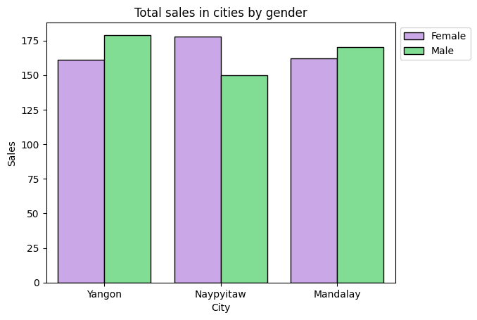
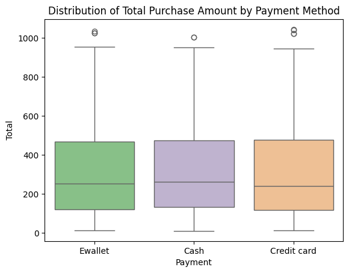

## Table of contents

 - [Project information](#project-information)
 - [Data cleaning](#data-cleaning)
 - [Data visualization](#data-visualization)
 - [Dashboard](#dashboard)
 - [Recommendations](#recommendations)

# Project information
The analysis is based on supermarket sales data from a three-month period (January–March) in 2019. The supermarket has branches in three different cities. The goal of this analysis is to identify key sales trends, customer preferences, and evaluate differences in the popularity of product categories depending on location.

#### Questions this analysis aims to answer:
- What is the distribution of customers by gender and city
- What factors influence customer satisfaction levels
- Which product lines are the most and least popular in different cities
- Is there a relationship between the price of a product and the quantity in which it is purchased
- Which cities and product categories generate the highest profit
- During which hours do stores experience the highest customer traffic

```python
import pandas as pd
import numpy as np
import matplotlib.pylab as plt
import seaborn as sns
```

# Data cleaning


```python
df= pd.read_csv(r"D:\power_bi_projects\data\supermarket_sales.csv")
df.head()
```


<div>
<style scoped>
    .dataframe tbody tr th:only-of-type {
        vertical-align: middle;
    }

    .dataframe tbody tr th {
        vertical-align: top;
    }

    .dataframe thead th {
        text-align: right;
    }
</style>
<table border="1" class="dataframe">
  <thead>
    <tr style="text-align: right;">
      <th></th>
      <th>Invoice ID</th>
      <th>Branch</th>
      <th>City</th>
      <th>Customer type</th>
      <th>Gender</th>
      <th>Product line</th>
      <th>Unit price</th>
      <th>Quantity</th>
      <th>Tax 5%</th>
      <th>Total</th>
      <th>Date</th>
      <th>Time</th>
      <th>Payment</th>
      <th>cogs</th>
      <th>gross margin percentage</th>
      <th>gross income</th>
      <th>Rating</th>
    </tr>
  </thead>
  <tbody>
    <tr>
      <th>0</th>
      <td>750-67-8428</td>
      <td>A</td>
      <td>Yangon</td>
      <td>Member</td>
      <td>Female</td>
      <td>Health and beauty</td>
      <td>74.69</td>
      <td>7</td>
      <td>26.1415</td>
      <td>548.9715</td>
      <td>1/5/2019</td>
      <td>13:08</td>
      <td>Ewallet</td>
      <td>522.83</td>
      <td>4.761905</td>
      <td>26.1415</td>
      <td>9.1</td>
    </tr>
    <tr>
      <th>1</th>
      <td>226-31-3081</td>
      <td>C</td>
      <td>Naypyitaw</td>
      <td>Normal</td>
      <td>Female</td>
      <td>Electronic accessories</td>
      <td>15.28</td>
      <td>5</td>
      <td>3.8200</td>
      <td>80.2200</td>
      <td>3/8/2019</td>
      <td>10:29</td>
      <td>Cash</td>
      <td>76.40</td>
      <td>4.761905</td>
      <td>3.8200</td>
      <td>9.6</td>
    </tr>
    <tr>
      <th>2</th>
      <td>631-41-3108</td>
      <td>A</td>
      <td>Yangon</td>
      <td>Normal</td>
      <td>Male</td>
      <td>Home and lifestyle</td>
      <td>46.33</td>
      <td>7</td>
      <td>16.2155</td>
      <td>340.5255</td>
      <td>3/3/2019</td>
      <td>13:23</td>
      <td>Credit card</td>
      <td>324.31</td>
      <td>4.761905</td>
      <td>16.2155</td>
      <td>7.4</td>
    </tr>
    <tr>
      <th>3</th>
      <td>123-19-1176</td>
      <td>A</td>
      <td>Yangon</td>
      <td>Member</td>
      <td>Male</td>
      <td>Health and beauty</td>
      <td>58.22</td>
      <td>8</td>
      <td>23.2880</td>
      <td>489.0480</td>
      <td>1/27/2019</td>
      <td>20:33</td>
      <td>Ewallet</td>
      <td>465.76</td>
      <td>4.761905</td>
      <td>23.2880</td>
      <td>8.4</td>
    </tr>
    <tr>
      <th>4</th>
      <td>373-73-7910</td>
      <td>A</td>
      <td>Yangon</td>
      <td>Normal</td>
      <td>Male</td>
      <td>Sports and travel</td>
      <td>86.31</td>
      <td>7</td>
      <td>30.2085</td>
      <td>634.3785</td>
      <td>2/8/2019</td>
      <td>10:37</td>
      <td>Ewallet</td>
      <td>604.17</td>
      <td>4.761905</td>
      <td>30.2085</td>
      <td>5.3</td>
    </tr>
  </tbody>
</table>
</div>


```python
df = df.drop_duplicates() 
df= df.drop(columns=["Invoice ID","gross margin percentage"])
df.isnull().sum() 
```


    Branch           0
    City             0
    Customer type    0
    Gender           0
    Product line     0
    Unit price       0
    Quantity         0
    Tax 5%           0
    Total            0
    Date             0
    Time             0
    Payment          0
    cogs             0
    gross income     0
    Rating           0
    dtype: int64


```python
df["Time"]=pd.to_datetime(df["Time"],format="%H:%M") # changing data type
df["Date"]=pd.to_datetime(df["Date"],format="%m/%d/%Y")
```


```python
df["Full_date"] = df["Date"] + df["Time"].dt.time.astype(str).apply(pd.Timedelta) # adding new column
```


```python
df["Time"] = df["Full_date"].dt.time
df["Date"] = df["Full_date"].dt.date
```


```python
df.info()
```

    <class 'pandas.core.frame.DataFrame'>
    RangeIndex: 1000 entries, 0 to 999
    Data columns (total 16 columns):
     #   Column         Non-Null Count  Dtype         
    ---  ------         --------------  -----         
     0   Branch         1000 non-null   object        
     1   City           1000 non-null   object        
     2   Customer type  1000 non-null   object        
     3   Gender         1000 non-null   object        
     4   Product line   1000 non-null   object        
     5   Unit price     1000 non-null   float64       
     6   Quantity       1000 non-null   int64         
     7   Tax 5%         1000 non-null   float64       
     8   Total          1000 non-null   float64       
     9   Date           1000 non-null   object        
     10  Time           1000 non-null   object        
     11  Payment        1000 non-null   object        
     12  cogs           1000 non-null   float64       
     13  gross income   1000 non-null   float64       
     14  Rating         1000 non-null   float64       
     15  Full_date      1000 non-null   datetime64[ns]
    dtypes: datetime64[ns](1), float64(6), int64(1), object(8)
    memory usage: 125.1+ KB
    


```python
df.describe()
```


<div>
<style scoped>
    .dataframe tbody tr th:only-of-type {
        vertical-align: middle;
    }

    .dataframe tbody tr th {
        vertical-align: top;
    }

    .dataframe thead th {
        text-align: right;
    }
</style>
<table border="1" class="dataframe">
  <thead>
    <tr style="text-align: right;">
      <th></th>
      <th>Unit price</th>
      <th>Quantity</th>
      <th>Tax 5%</th>
      <th>Total</th>
      <th>cogs</th>
      <th>gross income</th>
      <th>Rating</th>
      <th>Full_date</th>
    </tr>
  </thead>
  <tbody>
    <tr>
      <th>count</th>
      <td>1000.000000</td>
      <td>1000.000000</td>
      <td>1000.000000</td>
      <td>1000.000000</td>
      <td>1000.00000</td>
      <td>1000.000000</td>
      <td>1000.00000</td>
      <td>1000</td>
    </tr>
    <tr>
      <th>mean</th>
      <td>55.672130</td>
      <td>5.510000</td>
      <td>15.379369</td>
      <td>322.966749</td>
      <td>307.58738</td>
      <td>15.379369</td>
      <td>6.97270</td>
      <td>2019-02-14 15:30:27.480000</td>
    </tr>
    <tr>
      <th>min</th>
      <td>10.080000</td>
      <td>1.000000</td>
      <td>0.508500</td>
      <td>10.678500</td>
      <td>10.17000</td>
      <td>0.508500</td>
      <td>4.00000</td>
      <td>2019-01-01 10:39:00</td>
    </tr>
    <tr>
      <th>25%</th>
      <td>32.875000</td>
      <td>3.000000</td>
      <td>5.924875</td>
      <td>124.422375</td>
      <td>118.49750</td>
      <td>5.924875</td>
      <td>5.50000</td>
      <td>2019-01-24 17:58:45</td>
    </tr>
    <tr>
      <th>50%</th>
      <td>55.230000</td>
      <td>5.000000</td>
      <td>12.088000</td>
      <td>253.848000</td>
      <td>241.76000</td>
      <td>12.088000</td>
      <td>7.00000</td>
      <td>2019-02-13 17:37:00</td>
    </tr>
    <tr>
      <th>75%</th>
      <td>77.935000</td>
      <td>8.000000</td>
      <td>22.445250</td>
      <td>471.350250</td>
      <td>448.90500</td>
      <td>22.445250</td>
      <td>8.50000</td>
      <td>2019-03-08 15:29:30</td>
    </tr>
    <tr>
      <th>max</th>
      <td>99.960000</td>
      <td>10.000000</td>
      <td>49.650000</td>
      <td>1042.650000</td>
      <td>993.00000</td>
      <td>49.650000</td>
      <td>10.00000</td>
      <td>2019-03-30 20:37:00</td>
    </tr>
    <tr>
      <th>std</th>
      <td>26.494628</td>
      <td>2.923431</td>
      <td>11.708825</td>
      <td>245.885335</td>
      <td>234.17651</td>
      <td>11.708825</td>
      <td>1.71858</td>
      <td>NaN</td>
    </tr>
  </tbody>
</table>
</div>


## Data visualization


```python
df.head()
```


<div>
<style scoped>
    .dataframe tbody tr th:only-of-type {
        vertical-align: middle;
    }

    .dataframe tbody tr th {
        vertical-align: top;
    }

    .dataframe thead th {
        text-align: right;
    }
</style>
<table border="1" class="dataframe">
  <thead>
    <tr style="text-align: right;">
      <th></th>
      <th>Branch</th>
      <th>City</th>
      <th>Customer type</th>
      <th>Gender</th>
      <th>Product line</th>
      <th>Unit price</th>
      <th>Quantity</th>
      <th>Tax 5%</th>
      <th>Total</th>
      <th>Date</th>
      <th>Time</th>
      <th>Payment</th>
      <th>cogs</th>
      <th>gross income</th>
      <th>Rating</th>
      <th>Full_date</th>
    </tr>
  </thead>
  <tbody>
    <tr>
      <th>0</th>
      <td>A</td>
      <td>Yangon</td>
      <td>Member</td>
      <td>Female</td>
      <td>Health and beauty</td>
      <td>74.69</td>
      <td>7</td>
      <td>26.1415</td>
      <td>548.9715</td>
      <td>2019-01-05</td>
      <td>13:08:00</td>
      <td>Ewallet</td>
      <td>522.83</td>
      <td>26.1415</td>
      <td>9.1</td>
      <td>2019-01-05 13:08:00</td>
    </tr>
    <tr>
      <th>1</th>
      <td>C</td>
      <td>Naypyitaw</td>
      <td>Normal</td>
      <td>Female</td>
      <td>Electronic accessories</td>
      <td>15.28</td>
      <td>5</td>
      <td>3.8200</td>
      <td>80.2200</td>
      <td>2019-03-08</td>
      <td>10:29:00</td>
      <td>Cash</td>
      <td>76.40</td>
      <td>3.8200</td>
      <td>9.6</td>
      <td>2019-03-08 10:29:00</td>
    </tr>
    <tr>
      <th>2</th>
      <td>A</td>
      <td>Yangon</td>
      <td>Normal</td>
      <td>Male</td>
      <td>Home and lifestyle</td>
      <td>46.33</td>
      <td>7</td>
      <td>16.2155</td>
      <td>340.5255</td>
      <td>2019-03-03</td>
      <td>13:23:00</td>
      <td>Credit card</td>
      <td>324.31</td>
      <td>16.2155</td>
      <td>7.4</td>
      <td>2019-03-03 13:23:00</td>
    </tr>
    <tr>
      <th>3</th>
      <td>A</td>
      <td>Yangon</td>
      <td>Member</td>
      <td>Male</td>
      <td>Health and beauty</td>
      <td>58.22</td>
      <td>8</td>
      <td>23.2880</td>
      <td>489.0480</td>
      <td>2019-01-27</td>
      <td>20:33:00</td>
      <td>Ewallet</td>
      <td>465.76</td>
      <td>23.2880</td>
      <td>8.4</td>
      <td>2019-01-27 20:33:00</td>
    </tr>
    <tr>
      <th>4</th>
      <td>A</td>
      <td>Yangon</td>
      <td>Normal</td>
      <td>Male</td>
      <td>Sports and travel</td>
      <td>86.31</td>
      <td>7</td>
      <td>30.2085</td>
      <td>634.3785</td>
      <td>2019-02-08</td>
      <td>10:37:00</td>
      <td>Ewallet</td>
      <td>604.17</td>
      <td>30.2085</td>
      <td>5.3</td>
      <td>2019-02-08 10:37:00</td>
    </tr>
  </tbody>
</table>
</div>


```python
sns.countplot(x="City",data=df,hue="Gender",palette=["#CB9DF0","#73EC8B"],edgecolor="black")
plt.legend(loc="upper left", bbox_to_anchor=(1, 1))
plt.ylabel("Sales")
plt.title("Total sales in cities by gender")
plt.show()

grp=df.groupby("Gender")["Total"].count().reset_index()
grp
```


    

    


<div>
<style scoped>
    .dataframe tbody tr th:only-of-type {
        vertical-align: middle;
    }

    .dataframe tbody tr th {
        vertical-align: top;
    }

    .dataframe thead th {
        text-align: right;
    }
</style>
<table border="1" class="dataframe">
  <thead>
    <tr style="text-align: right;">
      <th></th>
      <th>Gender</th>
      <th>Total</th>
    </tr>
  </thead>
  <tbody>
    <tr>
      <th>0</th>
      <td>Female</td>
      <td>501</td>
    </tr>
    <tr>
      <th>1</th>
      <td>Male</td>
      <td>499</td>
    </tr>
  </tbody>
</table>
</div>


- the chart presents a comparison of the number of purchases made by customers in different cities, categorized by gender
- the largest discrepancy in the number of purchases between women and men occurs in Naypyitaw, where women purchased approximately 15 more different products
- the differences in the number of purchased products between genders are small. Out of 1,000 products sold, 501 were purchased by women, and 499 by men


```python
cor=df.corr(numeric_only=True)
sns.heatmap(cor,cmap="coolwarm",annot=True, linewidth=.5)
plt.show()
```


    

    


- customer satisfaction with purchases (Rating) is independent of the other analyzed factors (customers base their ratings on different aspects)
- the quantity of purchased products (Quantity) is not related to their unit price (Unit price)
- the strong correlation between tax (Tax 5%), cost of goods sold (COGS), revenue (Total), and gross income (Gross income) aligns with expected financial relationships


```python
plt.figure(figsize=(9, 5))

sns.barplot(data=df, x="Product line", y="Total",edgecolor="black",errorbar=None,estimator=np.size,hue="City",palette="Accent")
plt.xticks(rotation=30,size=9)
r=range(0,25000,5000)
#plt.yticks(r, [f'{x/1000:.0f}k' for x in r])
plt.title("Total customers by product line and city")
plt.ylabel("Customers")
plt.xlabel("Product line")
plt.legend(loc="upper left", bbox_to_anchor=(1, 1))
plt.show()

grouped = df.groupby("Product line")["Total"].count().reset_index()
grouped = grouped.sort_values(by="Total",ascending=False)
grouped
```


    

    


<div>
<style scoped>
    .dataframe tbody tr th:only-of-type {
        vertical-align: middle;
    }

    .dataframe tbody tr th {
        vertical-align: top;
    }

    .dataframe thead th {
        text-align: right;
    }
</style>
<table border="1" class="dataframe">
  <thead>
    <tr style="text-align: right;">
      <th></th>
      <th>Product line</th>
      <th>Total</th>
    </tr>
  </thead>
  <tbody>
    <tr>
      <th>1</th>
      <td>Fashion accessories</td>
      <td>178</td>
    </tr>
    <tr>
      <th>2</th>
      <td>Food and beverages</td>
      <td>174</td>
    </tr>
    <tr>
      <th>0</th>
      <td>Electronic accessories</td>
      <td>170</td>
    </tr>
    <tr>
      <th>5</th>
      <td>Sports and travel</td>
      <td>166</td>
    </tr>
    <tr>
      <th>4</th>
      <td>Home and lifestyle</td>
      <td>160</td>
    </tr>
    <tr>
      <th>3</th>
      <td>Health and beauty</td>
      <td>152</td>
    </tr>
  </tbody>
</table>
</div>


- the chart presents the variation in product category popularity across different cities, indicating distinct shopping trends in each location
- the most popular categories are Fashion accessories (178 purchased products), Food and beverages (174), and Fashion accessories (170)
- the least popular category is Health and beauty, with a total of 152 products sold
- Naypyitaw stands out for its high demand for Food and beverages and Fashion accessories, which recorded the highest sales in this city. Meanwhile, Home and lifestyle and Sports and travel are significantly less popular, with around 20 fewer purchases than in other cities
- in Yangon, Home and lifestyle products are the most frequently purchased, achieving the highest sales among all cities. At the same time, Health and beauty is the least popular category in this location
- in Mandalay, Health and beauty dominates, with sales exceeding those in other cities


```python
sns.boxplot(x="Payment", y="Total", data=df,hue="Payment",palette="Accent")
plt.title("Distribution of Total Purchase Amount by Payment Method")
plt.show()
```


    

    


- the median transaction amounts for all payment methods are similar (around 250 USD), with the median for credit cards being slightly lower
- the interquartile ranges (between the lower and upper quartiles) are comparable across all analyzed payment methods
- the box plots indicate a small number of outliers for each of the analyzed payment methods

```python
plt.figure(figsize=(12,5))
df["Price bins"] = pd.cut(df["Unit price"], bins=30)
grouped = df.groupby("Price bins",observed=False)["Quantity"].sum().reset_index()
sns.barplot(data=grouped,x="Price bins",y="Quantity",estimator=np.sum,hue="Quantity",palette="flare",edgecolor="black")
plt.xticks(rotation=30,size=9, ha='right')
plt.title("Total purchased product quantity by price bins")
plt.show()
```


    

    


- there is no strong correlation between the unit price of a product and the quantity purchased by a customer
- the highest number of products sold (320 units) falls within the highest price range [96.9-99.9 USD], making this range stand out significantly compared to others. Customers also frequently chose products in the 19-22 USD and 73-76 USD price ranges


```python

```

# Dashboard


## Key information
The dashboard presents revenue and cost of sales for each day of the month, with filtering options for month and city. It includes a summary table by product line and a chart displaying aggregated revenue on an hourly scale.
- total revenue: $322.97K
- total cost of sales: $307.59K
- total gross profit: $15.38K
  
## Trend analysis
- on days such as the 4th, 13th, 18th, and 22nd of each month, there are declines in revenue. On the other hand, revenue increases are observed on 7th-9th and 15th. Declines and increases in revenue alternate throughout the month
- the most profitable city is Naypyitaw, where the gross profit amounted to $5.27K. Naypyitaw's highest earnings come from the Food and Beverages category (about $1.1K) and Fashion Accessories (around $1K)
- in other cities, the gross profit is $5.06K
- low revenues are observed in the afternoon hours (3:30 PM - 6:30 PM), while the highest earnings occur in the evening (7:00 PM - 7:30 PM), suggesting that customers tend to do more shopping after work.
- the highest gross profit was recorded in January ($5.54K), while the lowest was in February ($4.63K)
  


- najwyższe przychody odnotowano w soboty (łącznie 56 tys. USD), a następnie we wtorki (51 tys. USD)
- poniedziałki charakteryzują się najniższymi przychodami (38 tys. USD), co może wynikać z mniejszej liczby klientów po weekendowych zakupach
- sprzedaż w dni robocze (środa, czwartek, piątek) oraz niedziele utrzymuje się na stabilnym poziomie około 44 tyś. USD

## Analiza sprzedaży według linii produkcji
- różnice między przychodami różnych kategorii są niewielkie, największe są z Food and beverages (56,1 tyś. USD)
- najniższy dochód brutto ma Health and beauty (2,3 tyś. USD) (wynik niskiej sprzedaży), pozostałe mają w granicach 2,5-2,6 tyś. USD, co sugeruje stabliną sprzedaż

## Rekomendacje
- #### zwiększenie ilości klientów w tych dniach lub godzinach, gdy jest mniejszy ruch
  - wprowadzenie promocji, które obowiązują w czasie, gdy sprzedaż jest mniejsza
  - zbieranie punktów przez klientów za każde zrobione zakupy, których wysoka suma może przynieść nagrody
- #### zachęcenie do częstszego kupowania z mniej dochodowych kategorii (w szczególności Health and beauty)
  - rozszerzenie oferty w sklepach - wprowadzenie nowych, popularnych produktów
  - działania marketingowe w social mediach (prowadzenie kont np. tiktok, instagram, wysyłanie paczek influencerom, którzy mają wysoką oglądalność)
  - spersonalizowane promocje (wysyłane SMS-em) dla osób, które posiadają konto w sklepie
  - regularna zmiana aranżacji sklepu oraz ekspozycji plakatów, aby przyciągnąć uwagę klientów
- #### inwestycje w dochodowe linie produkcyjne w miastach, które osiągają najlepsze wyniki, w celu utrzymania i wzrostu zainteresowania klientów
  - rozszerzenie asortymentu - jeśli klieci wykazują zainteresowanie daną kategorią (np. Fashion accessories w Naypyitaw), można wprowadzić droższe, bardziej luksusowe produkty
  - powiększenie magazynów, w celu uniknięcia braków popularnych produktów (oraz zrobienie miejsca na nowe, zgodnie z powyżyszym podpunktem)
  - lokalne wydarzenia i współprace z influencerami – organizowanie eventów tematycznych, warsztatów w supermarketach oraz zapraszanie influencerów jako ambasadorów marki, aby zwiększyć zainteresowanie klientów
